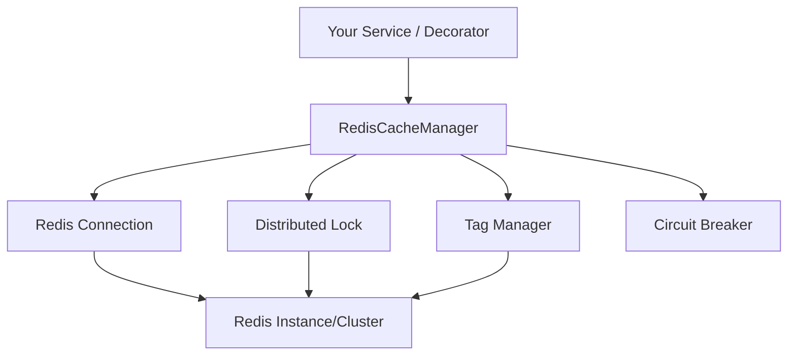

# MethodCache.Providers.Redis

Distributed Redis provider for MethodCache with hybrid L1/L2 orchestration, distributed locking, and tag-based invalidation.

## Highlights

- **Drop-in replacement** for the default in-memory cache manager – a single registration swaps providers.
- **Hybrid-ready**: integrates with `MethodCache.HybridCache` for L1/L2 strategies, compression, and multi-region replication.
- **Resilience built-in**: retry policies, circuit breaker options, and distributed locks mitigate downstream hiccups.
- **Tag invalidation** via Redis sets with efficient reverse indexing for bulk purges.
- **Serializer flexibility**: MessagePack (default), JSON, or plug your own serializer/compressor.
- **Fluent-friendly**: works seamlessly with the expanded fluent API (`WithVersion`, `WithKeyGenerator<T>`, predicates, etc.).

## Quick Start

### 1. Install packages

```bash
dotnet add package MethodCache.Providers.Redis
```

### 2. Register the provider and your caching rules

```csharp
using MethodCache.Providers.Redis.Extensions;

var builder = WebApplication.CreateBuilder(args);

builder.Services.AddRedisCache(options =>
{
    options.ConnectionString = "localhost:6379";
    options.KeyPrefix = "myapp:";
});

builder.Services.AddMethodCacheFluent(fluent =>
{
    fluent.ForService<IUserService>()
          .Method(s => s.GetUserAsync(default))
          .Configure(o => o
              .WithDuration(TimeSpan.FromMinutes(10))
              .WithTags("users"))
          .RequireIdempotent();
});
```

Existing interfaces, attributes, and configuration files continue to work—only the service registration changes.

### 3. (Optional) Hybrid cache in one call

```csharp
builder.Services.AddHybridRedisCache(options =>
{
    options.L1DefaultExpiration = TimeSpan.FromMinutes(5);
    options.EnableBackplane = true;
});
```

## Configuration

### Basic options

```csharp
services.AddRedisCache(options =>
{
    options.ConnectionString = "redis:6379";
    options.DatabaseNumber = 1;
    options.KeyPrefix = "prod:";
    options.DefaultExpiration = TimeSpan.FromHours(1);
});
```

### Advanced options

```csharp
services.AddRedisCache(options =>
{
    options.ConnectionString = "redis-1:6379,redis-2:6379";
    options.ConnectTimeout = TimeSpan.FromSeconds(5);
    options.SyncTimeout = TimeSpan.FromSeconds(5);

    options.DefaultSerializer = RedisSerializerType.MessagePack;
    options.Compression = CompressionType.None;

    options.Retry = new RetryOptions
    {
        MaxRetries = 3,
        BaseDelay = TimeSpan.FromMilliseconds(100),
        BackoffType = RetryBackoffType.ExponentialWithJitter
    };

    options.CircuitBreaker = new CircuitBreakerOptions
    {
        FailureRatio = 0.3,
        MinimumThroughput = 10,
        BreakDuration = TimeSpan.FromMinutes(2)
    };

    options.EnableDistributedLocking = true;
    options.EnablePubSubInvalidation = true;
    options.EnableDetailedMetrics = true;
});
```

## Architecture



## Migration from In-Memory

```csharp
// Was
services.AddMethodCache();

// Now
services.AddRedisCache("redis:6379");
```

All attributes, fluent rules, and configuration files continue to apply without modification.

## Production Tips

- **Redis setup**: use clustering/Sentinel for HA, enable persistence, monitor memory/evictions.
- **Security**: enable AUTH/TLS, restrict network access, keep Redis patched.
- **Observability**: plug in an `ICacheMetricsProvider` to forward hits/misses/errors to your telemetry stack.

```csharp
public sealed class RedisMetricsProvider : ICacheMetricsProvider
{
    public void CacheHit(string method) => _metrics.Increment("redis.cache.hit", new[] { ("method", method) });
    public void CacheError(string method, string error) => _logger.LogError("Redis error for {Method}: {Error}", method, error);
    // ...
}
```

## Performance Snapshot

| Scenario | Notes |
|----------|-------|
| Latency | 1–3 ms with local Redis, ~5–10 ms over the network |
| Throughput | 100k+ ops/sec per node with pooling/pipelining |
| Stampede protection | Distributed lock + probabilistic refresh-ahead |

## Troubleshooting

- **Connection failures**: verify connection string, Docker port mapping, firewalls, and TLS settings.
- **High latency**: check network distance, retry policy tuning, Redis CPU, and command pipelining.
- **Cache misses**: confirm key generation (versioning/prefix), expiration settings, and tag invalidation logic.

---

Need deeper diving? See the [Redis provider docs](../CONFIGURATION_GUIDE.md) or the [integration test suite](../MethodCache.Providers.Redis.IntegrationTests/README.md).
