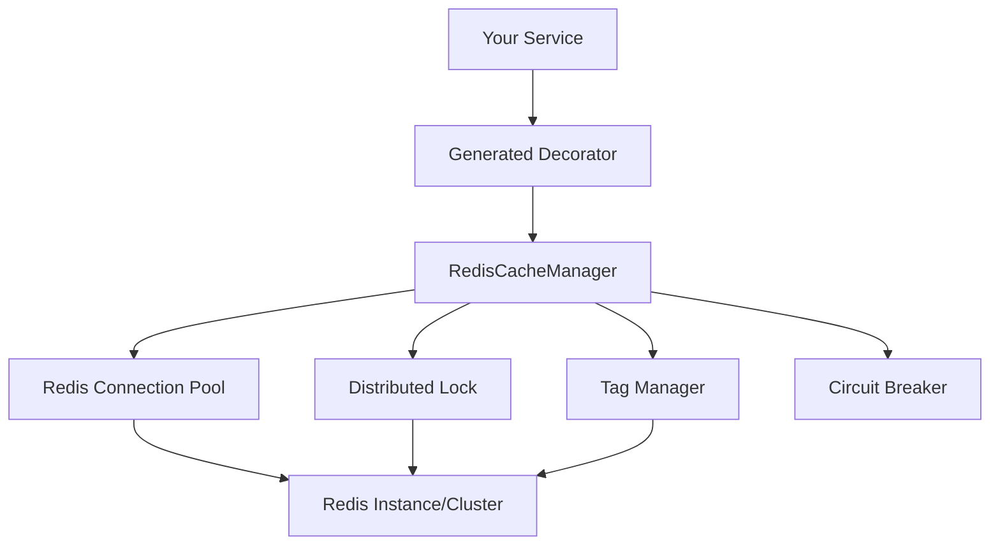

# MethodCache.Providers.Redis

A Redis distributed cache provider for MethodCache framework.

## Features

- **Distributed Caching**: Share cache across multiple application instances
- **Circuit Breaker**: Resilient handling of Redis failures with automatic fallback
- **Distributed Locking**: Prevent cache stampede using RedLock algorithm
- **Tag-based Invalidation**: Efficient cache invalidation using Redis Sets
- **Multiple Serializers**: MessagePack (default), JSON, and custom serializers
- **Comprehensive Configuration**: Flexible options for production deployments

## Quick Start

### Installation

```bash
dotnet add package StackExchange.Redis
# Then reference the MethodCache.Providers.Redis project
```

### Basic Usage

```csharp
// Program.cs
using MethodCache.Providers.Redis.Extensions;

var builder = WebApplication.CreateBuilder(args);

// Replace in-memory caching with Redis
builder.Services.AddRedisCache("localhost:6379");

// Register your services
builder.Services.AddSingleton<IUserService, UserService>();

var app = builder.Build();
```

### Service Interface (no changes needed!)

```csharp
public interface IUserService
{
    Task<User> GetUserAsync(int userId);
    Task UpdateUserAsync(User user);
}

public class UserService : IUserService
{
    [Cache] // Same attribute, now backed by Redis!
    public async Task<User> GetUserAsync(int userId)
    {
        return await _repository.GetByIdAsync(userId);
    }

    [CacheInvalidate(Tags = new[] { "users" })]
    public async Task UpdateUserAsync(User user)
    {
        await _repository.UpdateAsync(user);
    }
}
```

## Configuration

### Basic Configuration

```csharp
services.AddRedisCache(options =>
{
    options.ConnectionString = "localhost:6379";
    options.DatabaseNumber = 1;
    options.KeyPrefix = "myapp:cache:";
    options.DefaultExpiration = TimeSpan.FromHours(1);
});
```

### Advanced Configuration

```csharp
services.AddRedisCache(options =>
{
    options.ConnectionString = "redis-cluster:6379,redis-cluster:6380";
    options.DatabaseNumber = 0;
    options.KeyPrefix = "production:cache:";
    
    // Connection settings
    options.ConnectTimeout = TimeSpan.FromSeconds(5);
    options.SyncTimeout = TimeSpan.FromSeconds(5);
    
    // Serialization
    options.DefaultSerializer = RedisSerializerType.MessagePack;
    options.Compression = CompressionType.None;
    
    // Resilience
    options.CircuitBreaker = new CircuitBreakerOptions
    {
        FailureRatio = 0.3,
        MinimumThroughput = 10,
        BreakDuration = TimeSpan.FromMinutes(2)
    };
    
    options.Retry = new RetryOptions
    {
        MaxRetries = 3,
        BaseDelay = TimeSpan.FromMilliseconds(100),
        BackoffType = RetryBackoffType.ExponentialWithJitter
    };
    
    // Advanced features
    options.EnableDistributedLocking = true;
    options.EnablePubSubInvalidation = false;
    options.EnableDetailedMetrics = true;
});
```

## Architecture

The Redis provider implements the same `ICacheManager` interface as the in-memory provider, ensuring complete compatibility:



## Key Components

### RedisCacheManager
- Core cache operations (get/set/invalidate)
- Circuit breaker protection
- Automatic fallback to direct execution on failures

### RedisTagManager
- Efficient tag-to-key mapping using Redis Sets
- Bulk invalidation operations
- Automatic cleanup of orphaned associations

### RedisDistributedLock
- RedLock algorithm implementation
- Cache stampede prevention
- Automatic lock renewal for long-running operations

### MessagePackRedisSerializer
- High-performance binary serialization
- Type-safe serialization/deserialization
- Minimal memory footprint

## Production Considerations

### Redis Setup
- Use Redis Cluster for high availability
- Configure persistence (AOF + RDB)
- Monitor memory usage and key expiration
- Set up Redis Sentinel for automatic failover

### Application Configuration
- Tune circuit breaker thresholds based on your SLA
- Configure appropriate retry policies
- Enable detailed metrics for monitoring
- Use connection pooling for better performance

### Security
- Use Redis AUTH for authentication
- Enable TLS encryption for data in transit
- Configure firewall rules for Redis access
- Regular security updates for Redis server

## Monitoring

The Redis provider integrates with the existing metrics system:

```csharp
// Custom metrics provider
public class RedisMetricsProvider : ICacheMetricsProvider
{
    public void CacheHit(string methodName)
    {
        // Track Redis cache hits
        _metrics.Increment("redis.cache.hits", new[] { ("method", methodName) });
    }
    
    public void CacheError(string methodName, string error)
    {
        // Track Redis errors
        _logger.LogError("Redis cache error for {Method}: {Error}", methodName, error);
    }
}
```

## Migration from In-Memory

Migrating from in-memory to Redis cache requires only configuration changes:

```csharp
// Before (in-memory)
services.AddMethodCache();

// After (Redis)
services.AddRedisCache("redis-connection-string");
```

All your existing `[Cache]` and `[CacheInvalidate]` attributes continue to work unchanged!

## Performance

Expected performance characteristics:

- **Latency**: 1-3ms for local Redis, 5-10ms for remote Redis
- **Throughput**: 100K+ operations/sec per Redis instance  
- **Memory**: Shared across instances, reduced per-application memory
- **Scalability**: Horizontal scaling with Redis Cluster

## Troubleshooting

### Connection Issues
- Verify Redis server is running and accessible
- Check firewall and network connectivity
- Validate connection string format
- Monitor connection pool metrics

### Performance Issues
- Review circuit breaker configuration
- Check Redis memory usage and eviction policies
- Monitor network latency between app and Redis
- Consider using Redis pipelining for bulk operations

### Cache Misses
- Verify key generation consistency
- Check cache expiration settings
- Monitor Redis memory and key eviction
- Review tag-based invalidation logic