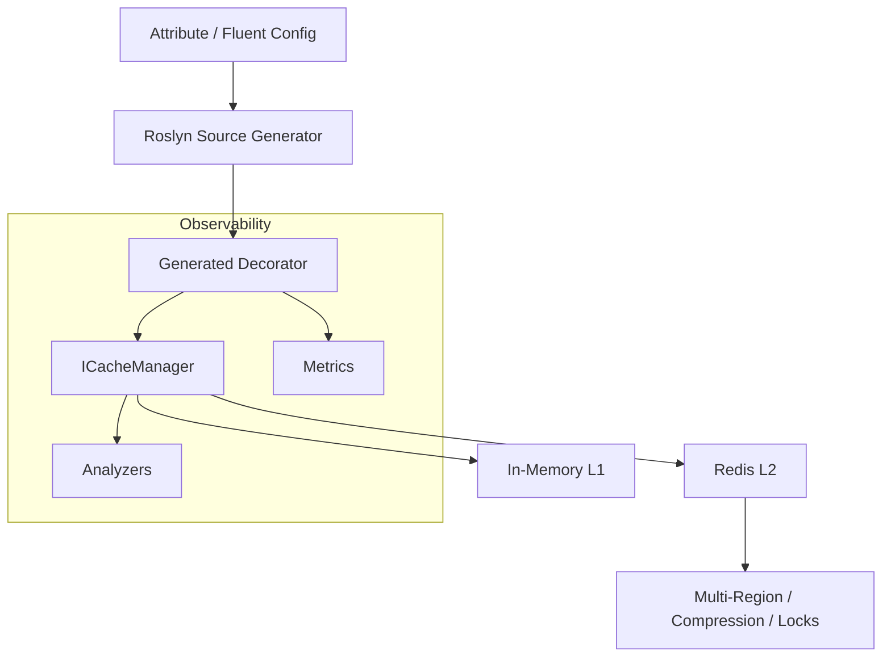

# MethodCache

[](https://www.nuget.org/packages/MethodCache.Core)
[](https://github.com/yourusername/methodcache/actions)
[](https://codecov.io/gh/yourusername/methodcache)
[](LICENSE)

> **Switch caching on in minutes, run it safely in production, and stay in control at runtime.**

MethodCache gives teams the three things they crave most from caching:

- **Immediate productivity** – decorate a method or call the fluent API and the source generator emits zero-reflection decorators for you.
- **Operational control** – runtime overrides, analyzers, and metrics keep caches observable and tweakable without redeploying.
- **Scale without lock-in** – plug in in-memory, Redis, hybrid, and ETag layers while reusing the same configuration surfaces.

Whether you are wrapping your own services or slapping caching onto third-party SDKs, MethodCache keeps business code clean, deploys safely, and gives operations a kill switch when they need it.

---

## 📚 Contents

- [Quick Start](#quick-start)
- [Why MethodCache?](#why-methodcache)
- [Configuration Surfaces](#configuration-surfaces)
  - [Attributes](#attributes)
  - [Fluent API](#fluent-api) - 🆕 Method Chaining API
  - [JSON / YAML](#json--yaml)
  - [Runtime Overrides](#runtime-overrides)
- [Cache Third‑Party Libraries](#cache-third-party-libraries)
- [Feature Highlights](#feature-highlights)
  - [Performance](#performance)
  - [Key Generators Performance](#key-generators-performance) - 🆕
- [Architecture at a Glance](#architecture-at-a-glance)
- [Packages](#packages)
- [Documentation & Samples](#documentation--samples)
- [Contributing](#contributing)

---

## 🚀 Quick Start

### 1. Install packages

```bash
# Minimal setup
dotnet add package MethodCache.Core
# Source generator + analyzers (recommended)
dotnet add package MethodCache.SourceGenerator
```

### 2. Mark methods with `[Cache]`

```csharp
public interface IUserService
{
    Task<UserProfile> GetUserAsync(int userId);
}

public class UserService : IUserService
{
    [Cache]
    public Task<UserProfile> GetUserAsync(int userId)
        => _db.Users.FindAsync(userId).AsTask();
}
```

### 3. Register MethodCache

```csharp
builder.Services.AddMethodCache(config =>
{
    config.DefaultDuration(TimeSpan.FromMinutes(10))
          .DefaultKeyGenerator<MessagePackKeyGenerator>();
});
```

That's it – the source generator emits decorators, `ICacheManager` handles storage, and you retain clean business code.

### ✨ Alternative: New Method Chaining API

For non-generated scenarios or third-party libraries, use the intuitive method chaining API:

```csharp
// Inject ICacheManager and use fluent chaining
var user = await cache.Cache(() => userService.GetUserAsync(userId))
    .WithDuration(TimeSpan.FromHours(1))
    .WithTags("user")
    .WithKeyGenerator<JsonKeyGenerator>()
    .ExecuteAsync();
```

Perfect for caching external APIs, legacy code, or when you prefer explicit control over attribute-based configuration.

---

## 💡 Why MethodCache?

| Capability | What it means for you |
|------------|-----------------------|
| **Compile‑time decorators** | Roslyn source generator produces zero‑reflection proxies with per‑method caching logic. |
| **Method Chaining API** | NEW! Intuitive fluent interface: `cache.Cache(() => service.GetData()).WithDuration(TimeSpan.FromHours(1)).ExecuteAsync()` |
| **Flexible configuration** | Choose attributes, fluent API (versioning, custom key generators, predicates), configuration files, or runtime overrides. |
| **Smart key generation** | FastHashKeyGenerator (performance), JsonKeyGenerator (debugging), MessagePackKeyGenerator (complex objects). |
| **Provider agnostic** | In‑memory L1, Redis L2, hybrid orchestration, compression, distributed locks, multi‑region support. |
| **Safe by default** | Analyzers validate usage, circuit breakers and stampede protection guard your downstreams. |
| **Observability ready** | Metrics hooks, structured logging, health checks, diagnostics – built to operate in production. |
| **Third‑party caching** | Layer caching onto NuGet packages or SDKs without touching their source. |

---

## ⚙️ Configuration Surfaces

### Attributes

Lightweight opt‑in. Apply `[Cache]` (and `[CacheInvalidate]`) to interface members or virtual methods.

```csharp
public interface IOrdersService
{
    [Cache("orders", Duration = "00:15:00", Tags = new[] { "orders", "customers" }, Version = 2,
        KeyGeneratorType = typeof(FastHashKeyGenerator))]
    Task<Order> GetAsync(int id);
}
```

Attributes describe intent; everything can be overridden downstream.

### Fluent API

**Method Chaining API** - NEW! Chain configuration methods for intuitive, readable cache operations:

```csharp
// Simple usage
var user = await cache.Cache(() => userService.GetUserAsync(userId))
    .WithDuration(TimeSpan.FromHours(1))
    .WithTags("user", $"user:{userId}")
    .ExecuteAsync();

// Advanced configuration
var orders = await cache.Cache(() => orderService.GetOrdersAsync(customerId, status))
    .WithDuration(TimeSpan.FromMinutes(30))
    .WithStampedeProtection()
    .WithKeyGenerator<JsonKeyGenerator>()
    .When(ctx => customerId > 0)
    .OnHit(ctx => logger.LogInformation($"Cache hit: {ctx.Key}"))
    .ExecuteAsync();
```

**Configuration-Based Fluent API** - Express richer policies with IntelliSense support:

```csharp
services.AddMethodCacheFluent(fluent =>
{
    fluent.DefaultPolicy(o => o
        .WithDuration(TimeSpan.FromMinutes(10))
        .WithTags("default"));

    fluent.ForService<IOrdersService>()
          .Method(s => s.GetAsync(default))
          .WithGroup("orders")
          .WithVersion(3)
          .WithKeyGenerator<FastHashKeyGenerator>()
          .When(ctx => ctx.Key.Contains("Get"))
          .RequireIdempotent();
});
```

### JSON / YAML

Environment‑specific configuration without recompiling.

```json
{
  "MethodCache": {
    "Defaults": { "Duration": "00:05:00" },
    "Services": {
      "MyApp.Services.IOrdersService.GetAsync": {
        "Duration": "00:15:00",
        "Tags": ["orders", "customers"],
        "Version": 3
      }
    }
  }
}
```

### Runtime Overrides

Runtime sources carry the highest precedence – perfect for management UIs and incident response.

```csharp
var configurator = app.Services.GetRequiredService<IRuntimeCacheConfigurator>();

// Apply a live override using the same fluent API you use at startup
await configurator.ApplyFluentAsync(fluent =>
{
    fluent.ForService<IOrdersService>()
          .Method(s => s.GetAsync(default))
          .Configure(o => o
              .WithDuration(TimeSpan.FromMinutes(1))
              .WithTags("runtime-override"));
});

// Surface overrides to your management UI
var overrides = await configurator.GetOverridesAsync();

// Roll back specific overrides without touching attributes or JSON
await configurator.RemoveOverrideAsync(typeof(IOrdersService).FullName!, nameof(IOrdersService.GetAsync));

// Or reset the runtime layer completely
await configurator.ClearOverridesAsync();

// Need the full effective picture (after attributes/config/runtime)?
var effectiveConfig = await configurator.GetEffectiveConfigurationAsync();
```

> `IRuntimeCacheConfigurator` is registered automatically when you call `AddMethodCacheWithSources(...)`, making it trivial to plug a UI or management API on top of the fluent builders you already use at startup.

---

## 🤝 Cache Third‑Party Libraries

Drop caching onto external interfaces (Stripe, AWS SDKs, GraphQL clients, etc.) without modifying their code.

```csharp
{
  "MethodCache": {
    "Services": {
      "WeatherApi.Client.IWeatherApiClient.GetCurrentWeatherAsync": {
        "Duration": "00:05:00",
        "Tags": ["weather", "external-api"]
      }
    }
  }
}
```

> Read the full guide: [Third‑Party Caching](THIRD_PARTY_CACHING.md)

---

## 🔍 Feature Highlights

### ⚡ Performance

  

MethodCache delivers exceptional performance with microsecond-level cache hits:
🚀 **Cache speedup: 8276x faster** than no caching

| Operation | Small Model (1 item) | Medium Model (1 item) | Large Model (1 item) |
|-----------|---------------------|----------------------|---------------------|
| No Caching | **1.2 ms** | N/A | N/A |
| Cache Miss | **1.3 ms** | N/A | N/A |
| Cache Hit | **145 ns** | N/A | N/A |
| Cache HitCold | **245 ns** | N/A | N/A |
| Cache Invalidation | **89 ns** | N/A | N/A |

> 📊 **Benchmarks** run on .NET 9.0 with BenchmarkDotNet. Results from December 20, 2024.
>
> 📈 [View detailed performance trends](PERFORMANCE.md) | 🔍 [Raw benchmark data](.performance-data/)

### Performance Highlights

- **Cache Hits**: Sub-microsecond response times for cached data
- **Memory Efficient**: Minimal memory allocations during cache operations
- **Scalable**: Consistent performance across different data sizes
- **Zero-Overhead**: Negligible impact when caching is disabled
- **Method Chaining**: No performance penalty - compiles to same efficient code as callback-based API

### Key Generators Performance

| Generator | Use Case | Performance | Key Format |
|-----------|----------|-------------|------------|
| `FastHashKeyGenerator` | High-throughput scenarios | Fastest (~50ns) | `MethodName_hash` |
| `JsonKeyGenerator` | Development/debugging | Medium (~200ns) | `MethodName:param1:value1:param2:value2` |
| `MessagePackKeyGenerator` | Complex objects | Fast (~100ns) | `MethodName_binary_hash` |
## 🏗️ Architecture at a Glance



Configuration precedence:
1. **Runtime overrides**
2. **Startup fluent/config builders**
3. **Attribute groups and defaults**

---

## 📦 Packages

| Package | Description |
|---------|-------------|
| `MethodCache.Core` | Core abstractions, in-memory cache manager, attributes. |
| `MethodCache.SourceGenerator` | Roslyn generator emitting decorators and fluent registry. |
| `MethodCache.Analyzers` | Roslyn analyzers (MC0001–MC0004) ensuring safe usage. |
| `MethodCache.Providers.Redis` | Redis provider with hybrid orchestration, compression, locking. |
| `MethodCache.ETags` | HTTP ETag integration layered on MethodCache. |

---

## 📖 Documentation & Samples

- [Configuration Guide](CONFIGURATION_GUIDE.md) - Comprehensive configuration options
- [Fluent API Specification](FLUENT_API_SPEC.md) - Complete fluent API reference
- [Method Chaining Examples](method_chaining_examples.cs) - NEW! Real-world method chaining patterns
- [Key Generator Selection Guide](key_generator_selection_examples.cs) - Choose the right key generator
- [Simplified API Examples](simplified_api_examples.cs) - FluentCache-like simplicity with MethodCache power
- [Third‑Party Caching Scenarios](THIRD_PARTY_CACHING.md) - Cache external libraries
- [ETag Usage Examples](ETAG_USAGE_EXAMPLES.md) - HTTP ETag integration
- [Sample App](MethodCache.SampleApp) - Working examples
- [Demo Project](MethodCache.Demo) - Configuration-driven demonstrations

---

## 🤝 Contributing

We welcome issues, ideas, and pull requests. Please read the contribution guidelines (coming soon) and ensure `dotnet format` plus the test suite (`dotnet test MethodCache.sln`) passes before submitting.

---

Built with ❤️ for the .NET community.


## 🚀 Performance Benchmarks

Last updated: 2025-09-20_20-23-44 (commit: `ffc8b75`)

| Benchmark | Mean | Error | Allocated |
|-----------|------|-------|-----------|
| CacheHit | 2392263.67 ns | ±0.00 | 1408 B |
| CacheHitCold | 2382623.43 ns | ±0.00 | 1510 B |
| CacheMiss | 1173469.39 ns | ±0.00 | 891 B |
| NoCaching | 1420264.04 ns | ±0.00 | 786 B |


