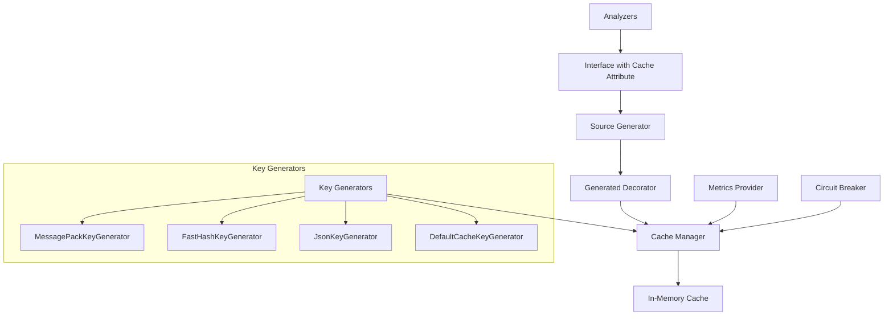

# MethodCache

[](https://www.nuget.org/packages/MethodCache.Core)
[](https://github.com/yourusername/methodcache/actions)
[](https://codecov.io/gh/yourusername/methodcache)
[](LICENSE)

> **Unobtrusive, high-performance caching for .NET with compile-time code generation and comprehensive runtime configuration.**

MethodCache is a production-ready caching library that adds caching capabilities to your methods with minimal code changes and zero business logic pollution. Using compile-time code generation for optimal performance while providing complete runtime configuration flexibility.

### 🎯 **Unique Capability: Cache Third-Party Libraries**
**Add caching to external libraries without modifying their code!** Use runtime configuration to cache expensive API calls from NuGet packages, SDKs, and external dependencies. [Learn more →](#-add-caching-to-third-party-libraries)

---

## ✨ Quick Start

Add caching to any interface method with a single attribute:

```csharp
public interface IUserService
{
    Task<User> GetUserAsync(int userId);
}

public class UserService : IUserService
{
    [Cache]
    public async Task<User> GetUserAsync(int userId)
    {
        return await _database.Users.FindAsync(userId);
    }
}
```

Configure caching behavior:

```csharp
services.AddMethodCache(config =>
{
    config.DefaultDuration(TimeSpan.FromMinutes(10))
          .DefaultKeyGenerator<MessagePackKeyGenerator>();
});
```

---

## 🎯 Key Features

### **Unobtrusive Design**
- **Single attribute marking** - Just `[Cache]` to enable caching
- **No business logic changes** - Methods remain pure and testable
- **Clean separation of concerns** - Infrastructure handled separately

### **Runtime Configuration**
- **Hot-reloadable settings** - Change cache behavior without recompilation
- **Environment-specific configuration** - Different settings for dev/staging/prod
- **A/B testing support** - Dynamic cache strategies
- **Type-safe configuration** - Full IntelliSense and compile-time validation

### **High Performance**
- **Compile-time code generation** - Zero runtime reflection overhead
- **Multiple key generation strategies** - Optimized for different scenarios
- **Cache stampede prevention** - Efficient handling of concurrent requests
- **Memory leak prevention** - Automatic cleanup of internal data structures

### **Production Ready**
- **Circuit breaker patterns** - Resilient handling of cache provider failures
- **Comprehensive monitoring** - Built-in metrics and telemetry
- **Security considerations** - Parameter redaction and secure key generation
- **Async/await best practices** - Proper cancellation token support

### **Enterprise Features**
- **Redis provider** - Distributed caching with advanced features
- **Hybrid L1/L2 caching** - In-memory + Redis for optimal performance
- **Multi-region support** - Global scale with region failover
- **Compression** - Automatic compression for large cached values
- **Distributed locking** - Cache stampede prevention across instances

---

## 🔥 Add Caching to Third-Party Libraries

**One of MethodCache's most powerful features:** You can add caching behavior to third-party libraries without modifying their code! Using runtime configuration with the highest priority, you can cache expensive external API calls, database queries, and more.

### Quick Example: Cache External API Calls

```csharp
// Third-party weather API client (from NuGet)
public interface IWeatherApiClient
{
    Task<WeatherData> GetCurrentWeatherAsync(string city);
    Task<Forecast> GetForecastAsync(string city, int days);
}

// Add caching via configuration - no code changes to the library!
{
  "MethodCache": {
    "Services": {
      "WeatherApi.Client.IWeatherApiClient": {
        "Methods": {
          "GetCurrentWeatherAsync": {
            "Duration": "00:05:00",  // Cache for 5 minutes
            "Tags": ["weather", "external-api"]
          },
          "GetForecastAsync": {
            "Duration": "01:00:00",  // Cache forecasts for 1 hour
            "Tags": ["weather", "forecast"]
          }
        }
      }
    }
  }
}

// That's it! The third-party library calls are now cached
var weather = await weatherClient.GetCurrentWeatherAsync("Seattle"); // First call: hits API
weather = await weatherClient.GetCurrentWeatherAsync("Seattle");     // Second call: from cache!
```

### Supported Scenarios

✅ **Interface-based libraries** - Any library that uses interfaces  
✅ **HTTP/REST clients** - RestSharp, Refit, Flurl, HttpClient wrappers  
✅ **Database libraries** - Dapper, Entity Framework, MongoDB drivers  
✅ **Cloud SDKs** - AWS SDK, Azure SDK, Google Cloud  
✅ **GraphQL clients** - GraphQL.Client, Hot Chocolate  
✅ **Payment gateways** - Stripe, PayPal, Square SDKs  

### Real-World Examples

#### 1. **Stripe Payment SDK**
```csharp
// Expensive Stripe API calls can be cached
{
  "MethodCache": {
    "Services": {
      "Stripe.IStripeClient": {
        "Methods": {
          "GetCustomerAsync": { "Duration": "00:30:00" },     // Cache customer data
          "GetInvoicesAsync": { "Duration": "00:15:00" },     // Cache invoice lists
          "ProcessPaymentAsync": { "Enabled": false }         // Never cache payments!
        }
      }
    }
  }
}
```

#### 2. **AWS S3 SDK**
```csharp
// Cache S3 metadata to reduce API calls
{
  "MethodCache": {
    "Services": {
      "Amazon.S3.IAmazonS3": {
        "Methods": {
          "GetObjectMetadataAsync": { "Duration": "01:00:00" },  // Metadata rarely changes
          "ListObjectsV2Async": { "Duration": "00:05:00" },      // Lists change more often
          "PutObjectAsync": { "Enabled": false }                 // Never cache writes
        }
      }
    }
  }
}
```

#### 3. **Entity Framework DbContext**
```csharp
// Cache read-only queries
{
  "MethodCache": {
    "Services": {
      "*Repository": {  // Pattern matching for all repositories
        "Methods": {
          "GetByIdAsync": { "Duration": "00:05:00" },
          "GetAllAsync": { "Duration": "00:01:00" },
          "SaveAsync": { "Enabled": false }  // Never cache writes
        }
      }
    }
  }
}
```

### Management Interface Control

Since runtime configuration has the **highest priority**, you can control third-party library caching from your management interface:

```csharp
[ApiController]
[Route("api/admin/third-party-cache")]
public class ThirdPartyCacheController : ControllerBase
{
    [HttpPost("configure")]
    public async Task<IActionResult> ConfigureThirdPartyCache(
        [FromBody] ThirdPartyCacheRequest request)
    {
        // Dynamically control third-party library caching
        var key = $"MethodCache:Services:{request.LibraryInterface}:Methods:{request.Method}";
        
        await _configService.UpdateAsync(key + ":Duration", request.Duration.ToString());
        await _configService.UpdateAsync(key + ":Enabled", request.Enabled.ToString());
        
        return Ok($"Third-party cache configured: {request.LibraryInterface}.{request.Method}");
    }
    
    [HttpPost("emergency-disable")]
    public async Task<IActionResult> DisableAllThirdPartyCaching()
    {
        // Emergency disable all external API caching
        await _configService.UpdateAsync("MethodCache:Services:*External*:Methods:*:Enabled", "false");
        return Ok("All third-party caching disabled");
    }
}
```

### Best Practices for Third-Party Caching

1. **Start Conservative** - Use short cache durations initially
2. **Monitor Performance** - Track cache hit rates and API usage reduction
3. **Never Cache Writes** - Only cache idempotent read operations
4. **Use Tags** - Group related third-party calls for easy invalidation
5. **Test Thoroughly** - Ensure cached data freshness meets requirements

[See full third-party caching documentation →](THIRD_PARTY_CACHING.md)

---

## 🚀 Benefits

| Benefit | Description |
|---------|-------------|
| **Developer Experience** | Add caching with minimal code changes, rich configuration API with full IntelliSense support |
| **Performance** | Compile-time code generation eliminates reflection overhead, optimized key generation strategies |
| **Flexibility** | Runtime configuration changes, multiple cache providers, extensible architecture |
| **Reliability** | Circuit breakers, graceful degradation, comprehensive error handling |
| **Maintainability** | Clean separation of concerns, excellent testability, clear configuration precedence |
| **Observability** | Built-in metrics, structured logging, health checks, performance monitoring |
| **Security** | Secure key generation, parameter redaction, guidance for sensitive data handling |

---

## 📦 Packages

| Package | Description | Status |
|---------|-------------|--------|
| **MethodCache.Core** | Core library with attributes and interfaces | ✅ Available |
| **MethodCache.SourceGenerator** | Roslyn source generator for decorator patterns | ✅ Available |
| **MethodCache.Analyzers** | Compile-time validation and warnings | ✅ Available |
| **MethodCache.Providers.Redis** | Redis provider with advanced features | ✅ Available |
| **MethodCache.ETags** | HTTP ETag caching with hybrid L1/L2 integration | ✅ Available |

---

## 🏷️ ETag Caching

HTTP ETag caching support with hybrid L1/L2 cache integration for optimal performance and bandwidth usage. Enables conditional HTTP caching and cross-instance ETag consistency.

### Key Features

- **Hybrid Cache Integration**: Leverages MethodCache's L1/L2 architecture for optimal ETag performance  
- **HTTP Standards Compliant**: Full support for ETags, If-None-Match, and 304 Not Modified responses
- **Cross-Instance Consistency**: ETag invalidation across multiple application instances
- **High Performance**: L1 cache for fast ETag validation, L2 for distributed consistency
- **Flexible Configuration**: Middleware and attribute-based configuration options

### Quick Setup

```csharp
// Install the ETag package
dotnet add package MethodCache.ETags

// Configure services
services.AddHybridCache<RedisCacheManager>()  // Your L2 cache
    .AddETagSupport(options =>
    {
        options.DefaultExpiration = TimeSpan.FromHours(24);
        options.CacheableContentTypes = new[] { "application/json", "text/html" };
    });

// Configure pipeline
app.UseETagCaching();  // Add early in pipeline
```

### Method-Level ETag Caching

```csharp
using MethodCache.ETags.Attributes;

public class UserService
{
    [Cache(Duration = "1h")]
    [ETag]  // Enable ETag support
    public async Task<UserProfile> GetUserProfile(int userId)
    {
        return await _repository.GetUserAsync(userId);
    }

    [Cache(Duration = "30m")]
    [ETag(Strategy = ETagGenerationStrategy.LastModified)]
    public async Task<List<Product>> GetProducts()
    {
        return await _repository.GetProductsAsync();
    }
}
```

### Programmatic ETag Usage

```csharp
public class ApiController : ControllerBase
{
    private readonly IETagCacheManager _etagCache;

    [HttpGet("users/{id}")]
    public async Task<IActionResult> GetUser(int id)
    {
        var ifNoneMatch = Request.Headers.IfNoneMatch.ToString();
        
        var result = await _etagCache.GetOrCreateWithETagAsync(
            $"user:{id}",
            async () => ETagCacheEntry<UserDto>.WithValue(
                await _userService.GetUserAsync(id),
                GenerateUserETag(id)),
            ifNoneMatch);

        if (result.ShouldReturn304)
        {
            return StatusCode(304);
        }

        Response.Headers.ETag = result.ETag;
        return Ok(result.Value);
    }
}
```

### Architecture Benefits

The ETag implementation leverages the existing hybrid cache architecture:

- **L1 Cache (In-Memory)**: Fastest ETag validation and immediate 304 responses
- **L2 Cache (Distributed)**: Cross-instance ETag consistency and persistent storage  
- **HTTP Layer**: Standard ETag headers and 304 Not Modified responses

This results in:
- ~0.1ms ETag validation for L1 hits
- 80-95% bandwidth savings for cacheable content
- Automatic cross-instance ETag invalidation

For complete documentation, see [MethodCache.ETags README](MethodCache.ETags/README.md).

---

## 🏗️ Architecture Overview



### **Dual-Phase Configuration**

1. **Lightweight Attributes** - Mark methods as cacheable with minimal decoration
2. **Rich Runtime Configuration** - Comprehensive behavior control without recompilation

### **Configuration Precedence**

1. **Runtime Dynamic** (highest) - Hot-reloadable settings
2. **Startup Configuration** - `services.AddMethodCache()`
3. **Attribute Groups** - `[Cache("group-name")]`
4. **Global Defaults** (lowest) - System-wide fallbacks

---

## 💡 Usage Examples

### Basic Caching

```csharp
public class UserService : IUserService
{
    [Cache]
    public async Task<User> GetUserAsync(int userId)
    {
        return await _database.Users.FindAsync(userId);
    }
    
    [Cache("user-profile")]
    public async Task<UserProfile> GetUserProfileAsync(int userId)
    {
        return await _database.UserProfiles.FindAsync(userId);
    }
}
```

### Advanced Configuration

```csharp
services.AddMethodCache(config =>
{
    // Global defaults
    config.DefaultDuration(TimeSpan.FromMinutes(5))
          .DefaultKeyGenerator<MessagePackKeyGenerator>();
});

// Register custom implementations
services.AddSingleton<ICacheManager, InMemoryCacheManager>();
services.AddSingleton<ICacheKeyGenerator, MessagePackKeyGenerator>();
services.AddSingleton<ICacheMetricsProvider, ConsoleCacheMetricsProvider>();

// Register your services with generated caching
services.AddSingleton<IUserService, UserService>();
```

### Cache Invalidation

```csharp
public class UserService : IUserService
{
    private readonly ICacheManager _cacheManager;
    
    [Cache]
    public async Task<User> GetUserAsync(int userId) => await _repo.GetAsync(userId);
    
    [CacheInvalidate(Tags = new[] { "users" })]
    public async Task UpdateUserAsync(User user) => await _repo.UpdateAsync(user);
    
    // Programmatic invalidation
    public async Task InvalidateUserCache()
    {
        await _cacheManager.InvalidateByTagsAsync("users");
    }
}
```

### Dynamic Configuration

```csharp
public class CacheManagementController : ControllerBase
{
    private readonly ICacheConfigurationService _cacheConfig;
    
    [HttpPost("cache/configure")]
    public async Task UpdateCacheConfiguration(CacheConfigRequest request)
    {
        var settings = new CacheMethodSettings
        {
            Duration = TimeSpan.FromMinutes(request.DurationMinutes),
            Enabled = request.Enabled,
            Tags = request.Tags
        };
        
        await _cacheConfig.UpdateMethodConfigurationAsync(
            request.MethodId, settings);
    }
}
```

---

## 🔧 Configuration Options

### Key Generation Strategies

| Generator | Use Case | Performance | Readability |
|-----------|----------|-------------|-------------|
| **MessagePackKeyGenerator** | Default, deterministic serialization | Good | Low |
| **FastHashKeyGenerator** | High-throughput scenarios with hashing | Excellent | Low |
| **JsonKeyGenerator** | Development/debugging | Fair | High |
| **DefaultCacheKeyGenerator** | Simple string-based keys | Good | Medium |

### Cache Providers

| Provider | Scope | Persistence | Scalability |
|----------|-------|-------------|-------------|
| **InMemoryCacheManager** | Single instance | In-memory | Low |
| **RedisCacheManager** | Distributed | Redis | High |
| **HybridCacheManager** | L1/L2 hybrid | In-memory + Redis | High |
| **MultiRegionCacheManager** | Multi-region | Redis clusters | Very High |
| **MockCacheManager** | Testing/development | In-memory | Low |
| **NoOpCacheManager** | Testing (no caching) | None | N/A |

---

## 📊 Performance

### Benchmarks

```
BenchmarkDotNet=v0.13.0, OS=Windows 10.0.19044
Intel Core i7-9700K CPU 3.60GHz, 1 CPU, 8 logical and 8 physical cores

|              Method |     Mean |   Error |  StdDev | Allocated |
|-------------------- |---------:|--------:|--------:|----------:|
|    DirectMethodCall |  1.23 μs | 0.01 μs | 0.01 μs |         - |
|      CachedCall_Hit |  1.45 μs | 0.02 μs | 0.01 μs |      32 B |
|     CachedCall_Miss |  8.76 μs | 0.12 μs | 0.11 μs |     384 B |
| TraditionalCaching  | 12.34 μs | 0.18 μs | 0.16 μs |     512 B |
```

### Memory Usage

- **Generated code overhead**: ~2KB per cached method
- **Runtime overhead**: ~50 bytes per cache entry
- **Memory leak prevention**: Automatic cleanup of internal structures

---

## 🛡️ Security

### Best Practices

- **Parameter redaction** in logs for sensitive data
- **Secure key generation** prevents cache key injection
- **Data-at-rest encryption** guidance for sensitive cached data
- **Multi-tenant isolation** patterns for shared cache instances

### Configuration

> **Note**: Advanced security features are planned for future releases.

```csharp
// Current approach: Use NoOpCacheManager for sensitive operations
services.AddSingleton<ICacheManager, NoOpCacheManager>();

// Or exclude sensitive parameters from cache keys
public class SecureKeyGenerator : ICacheKeyGenerator
{
    public string GenerateKey(string methodName, object[] args, CacheMethodSettings settings)
    {
        // Custom logic to exclude sensitive data from keys
        return base.GenerateKey(methodName, FilterSensitiveArgs(args), settings);
    }
}
```

---

## 📈 Monitoring & Observability

### Built-in Metrics

```csharp
public class CustomMetricsProvider : ICacheMetricsProvider
{
    public void CacheHit(string methodName)
    {
        // Record cache hit
        Console.WriteLine($"Cache HIT: {methodName}");
    }
    
    public void CacheMiss(string methodName)
    {
        // Record cache miss
        Console.WriteLine($"Cache MISS: {methodName}");
    }
    
    public void CacheError(string methodName, string error)
    {
        // Record cache error
        Console.WriteLine($"Cache ERROR: {methodName} - {error}");
    }
}
```

### Health Checks

> **Note**: Built-in health checks are planned for future releases. Currently, monitor through metrics.

```csharp
// Use custom metrics provider for monitoring
services.AddSingleton<ICacheMetricsProvider, EnhancedMetricsProvider>();
```

### Logging Integration

> **Note**: Advanced logging configuration is planned for future releases. Currently, use the console metrics provider for basic monitoring.

```csharp
services.AddMethodCache();
services.AddSingleton<ICacheMetricsProvider, ConsoleCacheMetricsProvider>();
```

---

## 🧪 Testing

### Unit Testing

```csharp
[Test]
public async Task Should_Cache_User_Data()
{
    // Arrange
    var services = new ServiceCollection()
        .AddMethodCache(config => config.UseProvider<NoOpCacheProvider>())
        .AddSingleton<IUserService, UserService>()
        .BuildServiceProvider();
    
    var userService = services.GetService<IUserService>();
    
    // Act & Assert
    var user1 = await userService.GetUserAsync(1);
    var user2 = await userService.GetUserAsync(1); // Should use cache
    
    Assert.AreEqual(user1.Id, user2.Id);
}
```

### Integration Testing

```csharp
[Test]
public async Task Should_Invalidate_Cache_On_Update()
{
    // Arrange
    using var testHost = await CreateTestHost();
    var userService = testHost.Services.GetService<IUserService>();
    var cacheManager = testHost.Services.GetService<ICacheManager>();
    
    // Act
    var user = await userService.GetUserAsync(1);        // Cache miss
    await userService.UpdateUserAsync(user);             // Should invalidate
    var updatedUser = await userService.GetUserAsync(1); // Cache miss again
    
    // Assert
    Assert.AreNotEqual(user.UpdatedDate, updatedUser.UpdatedDate);
}
```

---

## 🤝 Contributing

We welcome contributions! Please see our [Contributing Guide](CONTRIBUTING.md) for details.

### Development Setup

```bash
git clone https://github.com/yourusername/methodcache.git
cd methodcache
dotnet restore
dotnet build
dotnet test
```

### Project Structure

```
MethodCache/
├── MethodCache.Core/              # Core library and interfaces
├── MethodCache.SourceGenerator/   # Roslyn source generator
├── MethodCache.Analyzers/         # Roslyn analyzers
├── MethodCache.Providers.Redis/           # Redis provider with enterprise features
├── MethodCache.ETags/             # HTTP ETag caching with hybrid L1/L2 integration
├── MethodCache.Providers.Redis.Tests/    # Redis provider unit tests
├── MethodCache.Tests/                     # Core library unit tests
├── MethodCache.SampleApp/         # Sample application
└── MethodCache.Demo/              # Demo project
```

---

## 📄 License

This project is licensed under the MIT License - see the [LICENSE](LICENSE) file for details.

---

## 🏆 Acknowledgments

- Inspired by [PostSharp](https://www.postsharp.net/) and [Castle DynamicProxy](http://www.castleproject.org/projects/dynamicproxy/)
- Built with [Roslyn Source Generators](https://docs.microsoft.com/en-us/dotnet/csharp/roslyn-sdk/source-generators-overview)
- Uses [MessagePack](https://github.com/neuecc/MessagePack-CSharp) in contractless mode for universal serialization

---

# 📖 Developer Guide

## Table of Contents

1. [Installation](#installation)
2. [Basic Setup](#basic-setup)
3. [Configuration](#configuration)
4. [Advanced Features](#advanced-features)
5. [Providers](#providers)
6. [Best Practices](#best-practices)
7. [Troubleshooting](#troubleshooting)
8. [Migration Guide](#migration-guide)

---

## Installation

### Package Installation

```bash
# Core package (includes source generator and analyzers)
dotnet add package MethodCache.Core
```

### Prerequisites

- **.NET 9.0** or higher
- **C# 10.0** or higher (for source generators)

---

## Basic Setup

### 1. Enable Source Generator

Ensure your project file includes:

```xml
<Project Sdk="Microsoft.NET.Sdk">
  <PropertyGroup>
    <TargetFramework>net8.0</TargetFramework>
    <LangVersion>latest</LangVersion>
    <EmitCompilerGeneratedFiles>true</EmitCompilerGeneratedFiles>
  </PropertyGroup>
</Project>
```

### 2. Dependency Injection Setup

#### ASP.NET Core

```csharp
// Program.cs
var builder = WebApplication.CreateBuilder(args);

builder.Services.AddMethodCache(config =>
{
    config.DefaultDuration(TimeSpan.FromMinutes(5))
          .DefaultKeyGenerator<MessagePackKeyGenerator>();
});

// Register your services
builder.Services.AddSingleton<IUserService, UserService>();

var app = builder.Build();
```

#### Console Application

```csharp
// Program.cs
using Microsoft.Extensions.DependencyInjection;
using Microsoft.Extensions.Hosting;

var host = Host.CreateDefaultBuilder(args)
    .ConfigureServices(services =>
    {
        services.AddMethodCache();
        services.AddSingleton<IUserService, UserService>();
    })
    .Build();

await host.RunAsync();
```

### 3. Mark Methods for Caching

```csharp
public interface IUserService
{
    Task<User> GetUserAsync(int userId);
    Task<List<User>> GetActiveUsersAsync();
    Task UpdateUserAsync(User user);
}

public class UserService : IUserService
{
    private readonly IUserRepository _repository;

    public UserService(IUserRepository repository)
    {
        _repository = repository;
    }

    [Cache]
    public async Task<User> GetUserAsync(int userId)
    {
        return await _repository.GetByIdAsync(userId);
    }

    [Cache("active-users")]
    public async Task<List<User>> GetActiveUsersAsync()
    {
        return await _repository.GetActiveAsync();
    }

    [CacheInvalidate(Tags = new[] { "users", "user-{userId}" })]
    public async Task UpdateUserAsync(User user)
    {
        await _repository.UpdateAsync(user);
    }
}
```

---

## Configuration

### Configuration Hierarchy

MethodCache uses a clear configuration precedence:

1. **Runtime Dynamic Configuration** (highest priority)
2. **Startup Configuration** (`services.AddMethodCache()`)
3. **Attribute Group Configuration** (`[Cache("group")]`)
4. **Global Defaults** (lowest priority)

### Startup Configuration

```csharp
services.AddMethodCache(config =>
{
    // Global defaults
    config.DefaultDuration(TimeSpan.FromMinutes(5))
          .DefaultKeyGenerator<MessagePackKeyGenerator>();
});

// Register specific implementations
services.AddSingleton<ICacheManager, InMemoryCacheManager>();
services.AddSingleton<ICacheKeyGenerator, MessagePackKeyGenerator>();
services.AddSingleton<ICacheMetricsProvider, ConsoleCacheMetricsProvider>();
```

### Runtime Configuration

```csharp
public class CacheManagementService
{
    private readonly ICacheConfigurationService _cacheConfig;

    public async Task UpdateCacheDuration(string methodId, TimeSpan duration)
    {
        var settings = new CacheMethodSettings
        {
            Duration = duration,
            Enabled = true
        };

        await _cacheConfig.UpdateMethodConfigurationAsync(methodId, settings);
    }

    public async Task DisableCaching(string methodId)
    {
        await _cacheConfig.EnableCachingAsync(methodId, false);
    }
}
```

### Environment-Specific Configuration

```csharp
services.AddMethodCache(config =>
{
    var duration = Environment.GetEnvironmentVariable("ASPNETCORE_ENVIRONMENT") == "Production"
        ? TimeSpan.FromHours(1)     // Production: 1 hour
        : TimeSpan.FromMinutes(5);  // Development: 5 minutes
        
    config.DefaultDuration(duration)
          .DefaultKeyGenerator<MessagePackKeyGenerator>();
});
```

---

## Advanced Features

### Tag-Based Invalidation

Tags provide a way to group and invalidate related cache entries:

```csharp
public interface IProductService
{
    Task<Product> GetProductAsync(int productId);
    Task UpdateProductAsync(Product product);
}

public class ProductService : IProductService
{
    [Cache]
    public async Task<Product> GetProductAsync(int productId)
    {
        return await _repository.GetProductAsync(productId);
    }

    [CacheInvalidate(Tags = new[] { "products" })]
    public async Task UpdateProductAsync(Product product)
    {
        await _repository.UpdateAsync(product);
    }
}
```

#### Programmatic Invalidation

```csharp
public class ProductManagementService
{
    private readonly ICacheManager _cacheManager;

    // Invalidate all products
    public async Task InvalidateAllProducts()
    {
        await _cacheManager.InvalidateByTagsAsync("products");
    }

    // Invalidate multiple tags
    public async Task InvalidateMultipleTags()
    {
        await _cacheManager.InvalidateByTagsAsync("products", "categories");
    }
}
```

### Custom Key Generation

```csharp
public class CustomUserKeyGenerator : ICacheKeyGenerator
{
    public string GenerateKey(string methodName, object[] args, CacheMethodSettings settings)
    {
        // Custom logic for user-specific keys
        if (methodName == "GetUserAsync" && args.Length > 0)
        {
            var userId = (int)args[0];
            return $"user:{userId}";
        }

        // Fallback to default behavior
        var keyBuilder = new StringBuilder();
        keyBuilder.Append(methodName);
        foreach (var arg in args)
        {
            keyBuilder.Append($":{arg}");
        }
        return keyBuilder.ToString();
    }
}

// Register custom generator
services.AddSingleton<ICacheKeyGenerator, CustomUserKeyGenerator>();
```

### Conditional Caching

> **Note**: Advanced conditional caching is planned for future releases. Currently, caching behavior is controlled by the RequireIdempotent attribute property.

```csharp
public interface IUserService
{
    Task<User> GetUserAsync(int userId);
}

public class UserService : IUserService
{
    [Cache(RequireIdempotent = true)]
    public async Task<User> GetUserAsync(int userId)
    {
        if (userId <= 0) return null; // Handle invalid IDs in method
        return await _repository.GetByIdAsync(userId);
    }
}
```

### Cache Versioning

> **Note**: Built-in cache versioning is planned for future releases. Currently, you can achieve versioning by changing method signatures or invalidating cache manually.

```csharp
public interface IUserService
{
    Task<User> GetUserV2Async(int userId); // Changed method name for versioning
}

public class UserService : IUserService
{
    [Cache]
    public async Task<User> GetUserV2Async(int userId)
    {
        return await _repository.GetUserV2Async(userId);
    }
    
    // Manual cache invalidation for version changes
    public async Task InvalidateOldUserCache()
    {
        await _cacheManager.InvalidateByTagsAsync("users");
    }
}
```

---

## Providers

### In-Memory Cache Manager (Default)

```csharp
services.AddMethodCache(config =>
{
    config.DefaultDuration(TimeSpan.FromMinutes(10))
          .DefaultKeyGenerator<MessagePackKeyGenerator>();
});

// The InMemoryCacheManager is used by default
services.AddSingleton<ICacheManager, InMemoryCacheManager>();
services.AddSingleton<ICacheMetricsProvider, ConsoleCacheMetricsProvider>();
```

### Redis Cache Provider

```csharp
// Add Redis cache with distributed features
services.AddRedisCache(options =>
{
    options.ConnectionString = "localhost:6379";
    options.KeyPrefix = "myapp:";
    options.DefaultExpiration = TimeSpan.FromHours(1);
    options.EnableDistributedLocking = true;
    options.EnablePubSubInvalidation = true;
});
```

### Hybrid L1/L2 Cache

```csharp
// Combines in-memory L1 with Redis L2 for optimal performance
services.AddHybridRedisCache(options =>
{
    options.Strategy = HybridStrategy.WriteThrough;
    options.L1DefaultExpiration = TimeSpan.FromMinutes(5);
    options.L2DefaultExpiration = TimeSpan.FromHours(1);
    options.EnableL1Warming = true;
});
```

### Multi-Region Cache

```csharp
// For global applications with multiple Redis regions
services.AddMultiRegionRedisCache(options =>
{
    options.AddRegion("us-east-1", "redis-east.example.com:6379", isPrimary: true)
           .AddRegion("us-west-2", "redis-west.example.com:6379")
           .WithFailoverStrategy(RegionFailoverStrategy.PriorityBased)
           .EnableCrossRegionInvalidation();
});
```


### Custom Cache Manager

```csharp
public class CustomCacheManager : ICacheManager
{
    public async Task<T> GetOrCreateAsync<T>(string methodName, object[] args, 
        Func<Task<T>> factory, CacheMethodSettings settings, 
        ICacheKeyGenerator keyGenerator, bool requireIdempotent)
    {
        // Custom caching implementation
    }

    public async Task InvalidateByTagsAsync(params string[] tags)
    {
        // Custom invalidation implementation
    }
}

// Registration
services.AddSingleton<ICacheManager, CustomCacheManager>();
```

---

## Best Practices

### 1. Method Design

```csharp
// ✅ Good: Idempotent methods
[Cache]
public async Task<User> GetUserAsync(int userId)
{
    return await _repository.GetByIdAsync(userId);
}

// ❌ Bad: Methods with side effects
[Cache] // Don't do this!
public async Task<int> CreateUserAsync(User user)
{
    return await _repository.CreateAsync(user); // Side effect!
}
```

### 2. Cache Key Strategy

```csharp
// ✅ Good: Include relevant parameters
[Cache]
public async Task<List<User>> GetUsersByRoleAsync(string role, bool includeInactive)
{
    return await _repository.GetByRoleAsync(role, includeInactive);
}

// ❌ Bad: Missing important parameters
[Cache]
public async Task<List<User>> GetUsersAsync()
{
    // Uses current user context - cache key won't differentiate users!
    var currentUserId = _currentUser.Id;
    return await _repository.GetUsersByManagerAsync(currentUserId);
}
```

### 3. Tag Hierarchies

```csharp
// ✅ Good: Hierarchical tags
services.AddMethodCache(config =>
{
    config.ForService<IProductService>()
          .Method(x => x.GetProductAsync(Any<int>()))
          .TagWith("products")                    // General tag
          .TagWith(ctx => $"product-{ctx.Args[0]}") // Specific tag
          .TagWith(ctx => GetProductCategory(ctx.Args[0])); // Category tag
});
```

### 4. Error Handling

```csharp
public class ResilientService
{
    [Cache]
    public async Task<User> GetUserAsync(int userId)
    {
        try
        {
            return await _repository.GetByIdAsync(userId);
        }
        catch (Exception ex)
        {
            _logger.LogError(ex, "Failed to get user {UserId}", userId);
            
            // Return default or throw - cache will handle gracefully
            throw;
        }
    }
}
```

### 5. Testing Strategy

```csharp
public class UserServiceTests
{
    [Test]
    public async Task Should_Return_User_From_Cache()
    {
        // Arrange
        var services = new ServiceCollection()
            .AddMethodCache(config => 
            {
                config.UseProvider<InMemoryTestCacheProvider>()
                      .ForService<IUserService>()
                      .Method(x => x.GetUserAsync(Any<int>()))
                      .Duration(TimeSpan.FromMinutes(5));
            })
            .AddSingleton<IUserService, UserService>()
            .BuildServiceProvider();

        var userService = services.GetService<IUserService>();
        var cacheProvider = services.GetService<ICacheProvider>();

        // Pre-populate cache
        await cacheProvider.SetAsync("UserService:GetUserAsync:1", 
            new User { Id = 1, Name = "Test" }, 
            TimeSpan.FromMinutes(5));

        // Act
        var user = await userService.GetUserAsync(1);

        // Assert
        Assert.AreEqual("Test", user.Name);
    }

    [Test]
    public async Task Should_Bypass_Cache_In_Test_Environment()
    {
        // Arrange
        var services = new ServiceCollection()
            .AddMethodCache(config => config.UseProvider<NoOpCacheProvider>())
            .AddSingleton<IUserService, UserService>()
            .BuildServiceProvider();

        // Cache is effectively disabled - all calls go to underlying service
    }
}
```

---

## Troubleshooting

### Common Issues

#### 1. Source Generator Not Running

**Symptoms**: No cache behavior, compilation warnings about missing types

**Solutions**:
```xml
<!-- Ensure these properties are set -->
<PropertyGroup>
    <EmitCompilerGeneratedFiles>true</EmitCompilerGeneratedFiles>
    <CompilerGeneratedFilesOutputPath>Generated</Comp