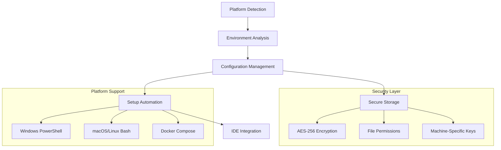

# 🧪 MethodCache Development Environment Guide

Complete guide for setting up and managing MethodCache development environments across different platforms with secure credential management and optimal performance.

## 📋 Table of Contents

- [Quick Start](#-quick-start)
- [Architecture Overview](#-architecture-overview)
- [Platform-Specific Setup](#-platform-specific-setup)
- [Secure Configuration Management](#-secure-configuration-management)
- [IDE Integration](#-ide-integration)
- [Performance Optimization](#-performance-optimization)
- [Troubleshooting](#-troubleshooting)
- [Advanced Usage](#-advanced-usage)

## 🚀 Quick Start

### One-Command Setup

**Windows:**
```powershell
# Automated setup with environment detection
.\scripts\setup-dev-env.ps1

# Non-interactive mode
.\scripts\setup-dev-env.ps1 -Interactive:$false
```

**macOS/Linux:**
```bash
# Automated setup with environment detection
./scripts/setup-dev-env.sh

# Non-interactive mode
./scripts/setup-dev-env.sh --non-interactive
```

### Validate Environment
```bash
# Check current setup status
dotnet run --project Tests/MethodCache.Tests.Infrastructure validate

# Get performance recommendations
dotnet run --project Tests/MethodCache.Tests.Infrastructure perf
```

### Run Tests
```bash
# Run integration tests with optimal configuration
dotnet test MethodCache.Providers.SqlServer.IntegrationTests
dotnet test MethodCache.Providers.Redis.IntegrationTests
```

## 🏗 Architecture Overview

### Core Components



### File Structure
```
MethodCache/
├── scripts/
│   ├── setup-dev-env.ps1          # Windows setup script
│   └── setup-dev-env.sh           # macOS/Linux setup script
├── Tests/MethodCache.Tests.Infrastructure/
│   ├── Environment/
│   │   └── TestEnvironmentDetector.cs    # Platform detection
│   ├── Configuration/
│   │   ├── SecureConfigurationManager.cs # Encrypted storage
│   │   └── UnifiedTestConfiguration.cs   # Unified config system
│   ├── Program.cs                  # CLI tool
│   └── README.md                   # Detailed documentation
├── .vscode/
│   ├── tasks.json                  # VSCode tasks
│   ├── launch.json                 # Debug configurations
│   └── settings.json               # Development settings
├── DEVELOPMENT_ENVIRONMENT_GUIDE.md # This file
```

## 🖥 Platform-Specific Setup

### Windows Development

#### Prerequisites
- **PowerShell 5.1+** (Built into Windows 10/11)
- **Optional:** Chocolatey for automated package installation

#### Automatic Setup
```powershell
# Run the automated setup
.\scripts\setup-dev-env.ps1

# With specific options
.\scripts\setup-dev-env.ps1 -ExternalOnly  # Skip Docker, use external services
.\scripts\setup-dev-env.ps1 -DockerOnly    # Use Docker for all services
```

#### Manual Setup
1. **SQL Server Options:**
   - SQL Server Express (recommended): `choco install sql-server-express`
   - SQL Server LocalDB: `choco install sql-server-2019-localdb`

2. **Redis Options:**
   - Redis for Windows: `choco install redis-64`

3. **Docker Desktop:**
   - Download: https://desktop.docker.com/win/main/amd64/Docker%20Desktop%20Installer.exe
   - Or via Chocolatey: `choco install docker-desktop`

#### Environment Variables
```powershell
# SQL Server (Windows Auth)
$env:METHODCACHE_SQLSERVER_URL = "Server=.;Database=MethodCacheTests;Trusted_Connection=true;"

# Redis
$env:METHODCACHE_REDIS_URL = "localhost:6379"
```

### macOS Development

#### Prerequisites
- **Homebrew** (recommended): `/bin/bash -c "$(curl -fsSL https://raw.githubusercontent.com/Homebrew/install/HEAD/install.sh)"`
- **Xcode Command Line Tools**: `xcode-select --install`

#### Apple Silicon (M1/M2) Optimization
```bash
# Install Rosetta 2 for x86 emulation
softwareupdate --install-rosetta --agree-to-license

# Enable Rosetta in Docker Desktop
# Settings → Features in development → Use Rosetta for x86/amd64 emulation
```

#### Automatic Setup
```bash
# Run the automated setup
./scripts/setup-dev-env.sh

# With specific options
./scripts/setup-dev-env.sh --external-only  # Skip Docker
./scripts/setup-dev-env.sh --docker-only    # Use Docker only
```

#### Manual Setup
1. **SQL Server Options:**
   - Docker (recommended): `docker run -e 'ACCEPT_EULA=Y' -e 'SA_PASSWORD=YourStrong@Passw0rd' -p 1433:1433 -d mcr.microsoft.com/mssql/server:2022-latest`
   - Azure SQL Edge: Lighter alternative for development

2. **Redis:**
   - Homebrew: `brew install redis && brew services start redis`

3. **Docker Desktop:**
   - Download: https://desktop.docker.com/mac/main/arm64/Docker.dmg (Apple Silicon)
   - Or via Homebrew: `brew install --cask docker`

#### Environment Variables
```bash
# Add to ~/.zshrc or ~/.bashrc
export METHODCACHE_SQLSERVER_URL="Server=localhost,1433;Database=MethodCacheTests;User Id=sa;Password=YourStrong@Passw0rd;TrustServerCertificate=true;"
export METHODCACHE_REDIS_URL="localhost:6379"
```

### Linux Development

#### Prerequisites
- **Package manager** (apt, yum, dnf, pacman)
- **.NET 9.0 SDK**

#### Automatic Setup
```bash
# Run the automated setup
./scripts/setup-dev-env.sh

# Non-interactive mode
./scripts/setup-dev-env.sh --non-interactive
```

#### Manual Setup
1. **SQL Server:**
   ```bash
   # Ubuntu/Debian
   curl -sSL https://packages.microsoft.com/keys/microsoft.asc | sudo apt-key add -
   sudo add-apt-repository "$(curl -sSL https://packages.microsoft.com/config/ubuntu/$(lsb_release -rs)/mssql-server-2022.list)"
   sudo apt-get update && sudo apt-get install -y mssql-server
   sudo /opt/mssql/bin/mssql-conf setup
   ```

2. **Redis:**
   ```bash
   # Ubuntu/Debian
   sudo apt-get install redis-server
   sudo systemctl enable redis-server
   sudo systemctl start redis-server
   ```

3. **Docker:**
   ```bash
   curl -fsSL https://get.docker.com -o get-docker.sh
   sudo sh get-docker.sh
   sudo usermod -aG docker $USER
   ```

## 🔒 Secure Configuration Management

### Overview
The secure configuration system provides encrypted storage for sensitive data with machine-specific encryption keys.

### Security Features
- **AES-256 Encryption** - Industry-standard encryption for sensitive data
- **Machine-Specific Keys** - Encryption keys tied to specific machines
- **Secure File Permissions** - OS-level protection (600/700 on Unix, ACL on Windows)
- **Environment Variable Fallbacks** - Flexible configuration hierarchy

### Configuration Storage

#### Locations
- **Windows:** `%USERPROFILE%\.methodcache\test-config\`
- **macOS/Linux:** `~/.methodcache/test-config/`

#### File Types
- `*.secure` - Encrypted files (passwords, API keys)
- `*.json` - Plain text files (non-sensitive configuration)
- `.machine-key` - Encryption key (auto-generated, machine-specific)

### Usage Examples

#### Store Sensitive Data
```bash
# GitHub token for PR testing
dotnet run --project Tests/MethodCache.Tests.Infrastructure config set github_token "ghp_xxxxxxxxxxxx" --secure

# Database passwords
dotnet run --project Tests/MethodCache.Tests.Infrastructure config set db_password "MySecurePassword123!" --secure
```

#### Store Configuration
```bash
# Connection strings
dotnet run --project Tests/MethodCache.Tests.Infrastructure config set redis_connection "localhost:6379"

# Test preferences
dotnet run --project Tests/MethodCache.Tests.Infrastructure config set docker_timeout "00:05:00"
```

#### List Configuration
```bash
# View all configuration (secure values show as [encrypted])
dotnet run --project Tests/MethodCache.Tests.Infrastructure config list
```

#### GitHub Integration Setup
```bash
# Set up GitHub for PR testing
dotnet run --project Tests/MethodCache.Tests.Infrastructure github --token "ghp_xxxxxxxxxxxx" --repo "eoniclabs/MethodCache"
```

### Configuration Hierarchy
The system checks configuration in this order:
1. **Secure configuration** (`~/.methodcache/test-config/*.secure`)
2. **Plain configuration** (`~/.methodcache/test-config/*.json`)
3. **Environment variables** (e.g., `METHODCACHE_REDIS_URL`)
4. **Default values** (built into the system)

## 🎯 IDE Integration

### Visual Studio Code

#### Available Tasks (Ctrl+Shift+P → "Tasks: Run Task")
- **Setup Development Environment** - Run platform-specific setup script
- **Check Test Environment** - Validate current configuration
- **Run All Integration Tests** - Execute complete integration test suite
- **Run SQL Server Integration Tests** - SQL Server-specific tests
- **Run Redis Integration Tests** - Redis-specific tests
- **Run Unit Tests Only** - Skip integration tests
- **Configure Test Environment** - Interactive configuration wizard
- **Start/Stop Docker Services** - Manage development containers

#### Debug Configurations (F5)
- **Setup Test Environment** - Debug the configuration tool
- **Debug SQL Server Integration Test** - Debug specific SQL Server tests
- **Debug Redis Integration Test** - Debug specific Redis tests
- **Run Benchmarks** - Performance testing
- **Debug Sample App** - Test the sample application

#### Optimized Settings
The `.vscode/settings.json` includes:
- C# semantic highlighting and formatting
- Test discovery configuration
- File nesting and exclusions
- Terminal environment variables
- IntelliSense optimizations

### Other IDEs

#### JetBrains Rider
```bash
# Set environment variables in Run/Debug Configuration
METHODCACHE_SQLSERVER_URL=Server=localhost;Database=MethodCacheTests;Trusted_Connection=true;
METHODCACHE_REDIS_URL=localhost:6379
```

#### Visual Studio (Windows)
```xml
<!-- In launchSettings.json -->
{
  "profiles": {
    "IntegrationTests": {
      "environmentVariables": {
        "METHODCACHE_SQLSERVER_URL": "Server=.;Database=MethodCacheTests;Trusted_Connection=true;",
        "METHODCACHE_REDIS_URL": "localhost:6379"
      }
    }
  }
}
```


## ⚡ Performance Optimization

### Performance Tiers

#### 🚀 Optimal Setup (~30 seconds)
- **External Redis** running locally
- **External SQL Server** (Express, Developer, or LocalDB)
- **No Docker containers** needed for tests

```bash
# Example configuration
METHODCACHE_REDIS_URL=localhost:6379
METHODCACHE_SQLSERVER_URL=Server=.;Database=MethodCacheTests;Trusted_Connection=true;
```

#### ⚡ Good Setup (~2 minutes)
- **One external service** + **one Docker container**
- Container reuse between test runs

#### 🐋 Docker Setup (~5 minutes first run, ~1 minute subsequent)
- **Both services in Docker containers**
- Automatic container management
- Container reuse for subsequent runs

### Platform-Specific Optimizations

#### Apple Silicon (M1/M2 Macs)
```bash
# Enable Rosetta 2
softwareupdate --install-rosetta --agree-to-license

# Use platform specification for SQL Server
docker run --platform linux/amd64 mcr.microsoft.com/mssql/server:2022-latest

# Enable Rosetta emulation in Docker Desktop
# Settings → Features in development → Use Rosetta for x86/amd64 emulation
```

#### Windows with WSL2
```powershell
# Use WSL2 backend for Docker Desktop for better performance
wsl --set-default-version 2

# Set Docker resources
# Docker Desktop → Settings → Resources → Advanced
# CPU: 4+ cores, Memory: 8+ GB
```

#### Linux Native
```bash
# Use native Docker for best performance
sudo systemctl enable docker
sudo usermod -aG docker $USER

# Consider using native Redis and SQL Server installations
```

### Container Optimization

#### Pre-pull Images
```bash
# Pre-pull images to avoid download time during tests
docker pull redis:7-alpine
docker pull mcr.microsoft.com/mssql/server:2022-latest
```

#### Resource Allocation
```yaml
# In docker-compose.dev.yml
services:
  redis:
    deploy:
      resources:
        limits:
          memory: 256M
        reservations:
          memory: 128M

  sqlserver:
    deploy:
      resources:
        limits:
          memory: 2G
        reservations:
          memory: 1G
```

## 🐛 Troubleshooting

### Common Issues and Solutions

#### Environment Detection Issues

**Issue:** `❌ Docker not available for integration tests`
```bash
# Solution: Check Docker installation and status
docker --version
docker info

# Start Docker Desktop (Windows/Mac)
# or start Docker daemon (Linux)
sudo systemctl start docker
```

**Issue:** `❌ No SQL Server instances found`
```bash
# Windows: Check SQL Server services
Get-Service -Name "MSSQL*"

# Linux: Check if SQL Server is running
sudo systemctl status mssql-server

# Or use Docker alternative
docker run -e "ACCEPT_EULA=Y" -e "SA_PASSWORD=YourStrong@Passw0rd" -p 1433:1433 -d mcr.microsoft.com/mssql/server:2022-latest
```

#### Configuration Issues

**Issue:** `❌ Permission denied accessing configuration directory`
```bash
# Check and fix permissions
ls -la ~/.methodcache/test-config/

# Fix permissions (macOS/Linux)
chmod 700 ~/.methodcache/test-config/
chmod 600 ~/.methodcache/test-config/*

# Windows: Run PowerShell as Administrator
```

**Issue:** `❌ Failed to decrypt configuration`
```bash
# Encryption key may have changed - reset configuration
rm -rf ~/.methodcache/test-config/
dotnet run --project Tests/MethodCache.Tests.Infrastructure setup
```

#### Connection Issues

**Issue:** `❌ Redis connection failed: Connection refused`
```bash
# Check Redis status
redis-cli ping  # Should return PONG

# Start Redis
# macOS: brew services start redis
# Linux: sudo systemctl start redis-server
# Windows: net start Redis
# Docker: docker run -d -p 6379:6379 redis:7-alpine
```

**Issue:** `❌ SQL Server connection failed`
```bash
# Test connection manually
sqlcmd -S localhost -U sa -P "YourStrong@Passw0rd" -Q "SELECT 1"

# Check SQL Server status
# Windows: Get-Service -Name "MSSQL*"
# Linux: sudo systemctl status mssql-server
```

#### Apple Silicon Specific Issues

**Issue:** SQL Server container performance issues
```bash
# Ensure Rosetta 2 is installed
softwareupdate --install-rosetta --agree-to-license

# Check Docker Desktop settings
# Enable "Use Rosetta for x86/amd64 emulation"

# Use explicit platform specification
docker run --platform linux/amd64 mcr.microsoft.com/mssql/server:2022-latest
```

### Debug Mode

#### Enable Verbose Logging
```bash
# Set debug environment variable
export METHODCACHE_DEBUG=true

# Run validation with debug output
dotnet run --project Tests/MethodCache.Tests.Infrastructure validate

# Check Docker container logs
docker-compose -f docker-compose.dev.yml logs -f
```

#### Performance Analysis
```bash
# Analyze current setup performance
dotnet run --project Tests/MethodCache.Tests.Infrastructure perf

# Time test execution
time dotnet test MethodCache.Providers.Redis.IntegrationTests
```

### Reset Everything

#### Complete Reset
```bash
# Stop all containers
docker-compose -f docker-compose.dev.yml down
docker container prune -f

# Remove configuration
rm -rf ~/.methodcache/test-config/  # macOS/Linux
rmdir /s %USERPROFILE%\.methodcache\test-config  # Windows

# Re-run setup
./scripts/setup-dev-env.sh  # macOS/Linux
.\scripts\setup-dev-env.ps1  # Windows
```

## 🚀 Advanced Usage

### Custom Configuration Scenarios

#### Multi-Environment Setup
```bash
# Development environment
dotnet run --project Tests/MethodCache.Tests.Infrastructure config set env "development"

# CI/CD environment
dotnet run --project Tests/MethodCache.Tests.Infrastructure config set env "ci" --config-path /ci/config

# Staging environment
dotnet run --project Tests/MethodCache.Tests.Infrastructure config set env "staging" --config-path /staging/config
```

#### Team Configuration Sharing
```bash
# Export non-sensitive configuration
dotnet run --project Tests/MethodCache.Tests.Infrastructure config list | grep -v "🔒" > team-config.txt

# Import configuration (each developer runs secure setup separately)
# Secure values (API keys) remain machine-specific
```

### CI/CD Integration

#### GitHub Actions
```yaml
# .github/workflows/publish.yml
name: Publish NuGet Package

on:
  push:
    branches:
      - master

jobs:
  publish:
    runs-on: ubuntu-latest
    services:
      redis:
        image: redis
        ports:
          - 6379:6379
    steps:
      - name: Checkout code
        uses: actions/checkout@v3
        with:
          fetch-depth: 0 # Recommended for Nerdbank.GitVersioning

      - name: Setup .NET
        uses: actions/setup-dotnet@v3
        with:
          dotnet-version: '8.0.x'

      - name: Install Nerdbank.GitVersioning
        run: dotnet tool restore

      - name: Set the version
        run: nbgv cloud

      - name: Restore dependencies
        run: dotnet restore

      - name: Build
        run: dotnet build --configuration Release --no-restore

      - name: Test
        run: dotnet test --configuration Release --no-build
        env:
          MethodCache_Redis_ConnectionString: "localhost:6379"

      - name: Pack
        run: dotnet pack --configuration Release --no-build -o ./artifacts

      - name: Publish to GitHub Packages
        run: dotnet nuget push "./artifacts/*.nupkg" --api-key ${{ secrets.GITHUB_TOKEN }} --source "https://nuget.pkg.github.com/eoniclabs/index.json"
```

### Performance Monitoring

#### Benchmark Integration
```bash
# Run performance benchmarks
dotnet run --project MethodCache.Benchmarks -c Release

# Compare different configurations
METHODCACHE_REDIS_URL=localhost:6379 dotnet run --project MethodCache.Benchmarks -c Release --filter "*Redis*"
```

#### Metrics Collection
```bash
# Enable metrics collection
export METHODCACHE_COLLECT_METRICS=true

# Run tests with timing
time dotnet test MethodCache.Providers.*.IntegrationTests --logger "console;verbosity=detailed"
```

### Security Hardening

#### Production Configuration
```bash
# Use strong passwords
dotnet run --project Tests/MethodCache.Tests.Infrastructure config set db_password "$(openssl rand -base64 32)" --secure

# Rotate encryption keys periodically
rm ~/.methodcache/test-config/.machine-key
dotnet run --project Tests/MethodCache.Tests.Infrastructure setup
```

#### Audit Configuration
```bash
# List all configuration with timestamps
dotnet run --project Tests/MethodCache.Tests.Infrastructure config list

# Check file permissions
ls -la ~/.methodcache/test-config/
```

## 📚 Additional Resources

### Documentation
- [Integration Test Strategy](INTEGRATION_TEST_STRATEGY.md) - Detailed testing approach
- [Docker Compose Guide](docker-compose.dev.yml) - Development services setup
- [VSCode Configuration](.vscode/) - IDE integration details
- [Test Infrastructure README](Tests/MethodCache.Tests.Infrastructure/README.md) - Tool documentation

### External Resources
- [Docker Desktop for Mac](https://docs.docker.com/desktop/mac/)
- [Docker Desktop for Windows](https://docs.docker.com/desktop/windows/)
- [SQL Server on Linux](https://docs.microsoft.com/en-us/sql/linux/)
- [Redis Installation Guide](https://redis.io/docs/getting-started/installation/)

### Community
- **Issues:** [GitHub Issues](https://github.com/eoniclabs/MethodCache/issues)
- **Discussions:** [GitHub Discussions](https://github.com/eoniclabs/MethodCache/discussions)
- **Wiki:** [Project Wiki](https://github.com/eoniclabs/MethodCache/wiki)

---

## 🎯 Summary

This development environment guide provides:

- ✅ **Cross-platform compatibility** - Windows, macOS, Linux
- ✅ **Secure credential management** - Encrypted storage, machine-specific keys
- ✅ **Performance optimization** - External services preferred, container reuse
- ✅ **Developer experience** - One-command setup, IDE integration
- ✅ **Platform-specific optimizations** - Apple Silicon, WSL2, native Linux
- ✅ **Comprehensive troubleshooting** - Common issues and solutions
- ✅ **CI/CD integration** - GitHub Actions, Azure DevOps examples
- ✅ **Advanced scenarios** - Multi-environment, team sharing, monitoring

The system automatically detects your environment and recommends the optimal setup for your platform, ensuring fast and reliable integration test execution across different development machines.