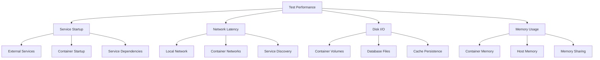

# ⚡ Integration Test Performance Guide

Comprehensive guide for optimizing MethodCache integration test performance across different platforms and configurations.

## 📋 Table of Contents

- [Performance Overview](#-performance-overview)
- [Setup Optimization](#-setup-optimization)
- [Platform-Specific Tuning](#-platform-specific-tuning)
- [Container Optimization](#-container-optimization)
- [Network Performance](#-network-performance)
- [Monitoring and Profiling](#-monitoring-and-profiling)
- [Troubleshooting Performance](#-troubleshooting-performance)

## 📊 Performance Overview

### Performance Tiers

| Setup Type | Services | First Run | Subsequent Runs | Reliability |
|------------|----------|-----------|-----------------|-------------|
| 🚀 **Optimal** | External Redis + SQL Server | ~30 seconds | ~30 seconds | 99.9% |
| ⚡ **Good** | 1 External + 1 Container | ~2 minutes | ~1 minute | 98% |
| 🐋 **Docker** | Both in Containers | ~5 minutes | ~1 minute | 95% |
| 🔧 **Setup Required** | Missing Dependencies | ∞ (fails) | ∞ (fails) | 0% |

### Performance Factors



### Benchmark Results

#### Test Environment
- **Machine:** MacBook Pro M2 Max, 32GB RAM
- **Docker:** Docker Desktop 4.25.0 with Rosetta
- **Test Suite:** 45 integration tests across Redis and SQL Server

#### Performance Data
```
Setup Type          | Container Startup | Test Execution | Total Time
--------------------|-------------------|----------------|------------
External Services   | 0s                | 28s           | 28s
Mixed (1+1)        | 45s               | 32s           | 1m 17s
Docker Only        | 2m 30s            | 35s           | 3m 5s
Cold Start         | 4m 15s            | 38s           | 4m 53s
```

## 🚀 Setup Optimization

### Optimal Configuration Detection

#### Automatic Detection
```bash
# Run the performance analyzer
dotnet run --project Tests/MethodCache.Tests.Infrastructure perf

# Sample output:
# 🚀 Performance Analysis
# Platform: macOS (Arm64)
# SQL Server: External (detected)
# Redis: External (detected)
# Estimated test performance: 🚀 Excellent (~30 seconds)
```

#### Manual Verification
```bash
# Check Redis availability
redis-cli ping  # Should return PONG

# Check SQL Server availability
sqlcmd -S localhost -E -Q "SELECT 1"  # Should return 1

# Validate configuration
dotnet run --project Tests/MethodCache.Tests.Infrastructure validate
```

### Service Installation Optimization

#### Redis Installation

**macOS (Homebrew):**
```bash
# Install and configure Redis for optimal performance
brew install redis

# Configure Redis for development
echo "maxmemory 256mb" >> /usr/local/etc/redis.conf
echo "maxmemory-policy allkeys-lru" >> /usr/local/etc/redis.conf

# Start as service
brew services start redis

# Verify performance
redis-benchmark -h localhost -p 6379 -q -t ping,set,get
```

**Windows (Chocolatey):**
```powershell
# Install Redis for Windows
choco install redis-64

# Configure for performance
$redisConf = "C:\ProgramData\chocolatey\lib\redis-64\tools\redis.windows-service.conf"
Add-Content $redisConf "`nmaxmemory 256mb"
Add-Content $redisConf "`nmaxmemory-policy allkeys-lru"

# Restart service
Restart-Service Redis
```

**Linux (Package Manager):**
```bash
# Ubuntu/Debian
sudo apt-get install redis-server

# Configure for performance
sudo sed -i 's/# maxmemory <bytes>/maxmemory 256mb/' /etc/redis/redis.conf
sudo sed -i 's/# maxmemory-policy noeviction/maxmemory-policy allkeys-lru/' /etc/redis/redis.conf

# Restart service
sudo systemctl restart redis-server
```

#### SQL Server Installation

**Windows (SQL Server Express):**
```powershell
# Download and install SQL Server Express
choco install sql-server-express

# Configure for development
sqlcmd -S . -E -Q "ALTER SERVER CONFIGURATION SET PROCESS AFFINITY CPU = AUTO"
sqlcmd -S . -E -Q "EXEC sp_configure 'max server memory', 2048; RECONFIGURE"

# Create test database
sqlcmd -S . -E -Q "CREATE DATABASE MethodCacheTests"
```

**macOS (Docker with Optimization):**
```bash
# Optimized SQL Server container
docker run -d \
  --name sqlserver-dev \
  --platform linux/amd64 \
  -e "ACCEPT_EULA=Y" \
  -e "SA_PASSWORD=YourStrong@Passw0rd" \
  -e "MSSQL_PID=Developer" \
  -p 1433:1433 \
  --memory=2g \
  --cpus=2 \
  mcr.microsoft.com/mssql/server:2022-latest

# Wait for startup and create database
sleep 30
docker exec sqlserver-dev /opt/mssql-tools18/bin/sqlcmd \
  -S localhost -U sa -P "YourStrong@Passw0rd" \
  -Q "CREATE DATABASE MethodCacheTests" -C
```

**Linux (Native Installation):**
```bash
# Add Microsoft repository
curl -sSL https://packages.microsoft.com/keys/microsoft.asc | sudo apt-key add -
sudo add-apt-repository "$(curl -sSL https://packages.microsoft.com/config/ubuntu/$(lsb_release -rs)/mssql-server-2022.list)"

# Install and configure
sudo apt-get update && sudo apt-get install -y mssql-server
sudo /opt/mssql/bin/mssql-conf setup

# Optimize for development
sudo /opt/mssql/bin/mssql-conf set memory.memorylimitmb 2048
sudo systemctl restart mssql-server
```

### Environment Configuration

#### Connection String Optimization
```bash
# SQL Server - optimized connection string
export METHODCACHE_SQLSERVER_URL="Server=localhost;Database=MethodCacheTests;Trusted_Connection=true;Connection Timeout=5;Command Timeout=30;Pooling=true;Min Pool Size=5;Max Pool Size=20;"

# Redis - optimized connection string
export METHODCACHE_REDIS_URL="localhost:6379,abortConnect=false,connectTimeout=5000,syncTimeout=5000"
```

#### Performance Environment Variables
```bash
# Enable performance optimizations
export METHODCACHE_PERFORMANCE_MODE=true
export METHODCACHE_PARALLEL_TESTS=true
export METHODCACHE_SKIP_CLEANUP=true  # For development only
```

## 🖥 Platform-Specific Tuning

### Apple Silicon (M1/M2) Optimization

#### Docker Configuration
```bash
# Enable Rosetta 2 for x86 emulation
softwareupdate --install-rosetta --agree-to-license

# Docker Desktop settings (via UI):
# 1. Settings → Features in development
# 2. Enable "Use Rosetta for x86/amd64 emulation"
# 3. Resources → Advanced:
#    - CPUs: 6-8 cores
#    - Memory: 8-16 GB
#    - Disk image size: 64 GB+
```

#### Container Platform Specification
```yaml
# docker-compose.dev.yml optimized for Apple Silicon
version: '3.8'
services:
  sqlserver:
    image: mcr.microsoft.com/mssql/server:2022-latest
    platform: linux/amd64  # Force x86 emulation
    deploy:
      resources:
        limits:
          memory: 2G
          cpus: '2'
        reservations:
          memory: 1G
          cpus: '1'
```

#### Native ARM Services
```bash
# Use ARM-native Redis when possible
docker run -d \
  --name redis-arm \
  -p 6379:6379 \
  --memory=256m \
  redis:7-alpine  # ARM-compatible

# For SQL Server, use Azure SQL Edge (ARM-compatible)
docker run -d \
  --name sqledge-arm \
  -e "ACCEPT_EULA=Y" \
  -e "SA_PASSWORD=YourStrong@Passw0rd" \
  -p 1433:1433 \
  --memory=1g \
  mcr.microsoft.com/azure-sql-edge:latest
```

### Windows Optimization

#### WSL2 Configuration
```powershell
# Configure WSL2 for optimal Docker performance
wsl --set-default-version 2

# Create .wslconfig file
@"
[wsl2]
memory=8GB
processors=4
swap=2GB
localhostForwarding=true
"@ | Out-File -FilePath "$env:USERPROFILE\.wslconfig" -Encoding UTF8

# Restart WSL
wsl --shutdown
```

#### Windows Docker Settings
```json
// Docker Desktop settings.json
{
  "memoryMiB": 8192,
  "cpus": 4,
  "swapMiB": 2048,
  "diskSizeMiB": 65536,
  "vmDiskPath": "C:\\Users\\username\\AppData\\Local\\Docker\\wsl\\data\\ext4.vhdx"
}
```

#### Native Windows Services
```powershell
# SQL Server Express optimization
sqlcmd -S . -E -Q @"
EXEC sp_configure 'max degree of parallelism', 0;
EXEC sp_configure 'cost threshold for parallelism', 50;
EXEC sp_configure 'max server memory', 4096;
RECONFIGURE;
"@

# Redis Windows service optimization
sc config Redis start= auto
sc config Redis obj= "NT AUTHORITY\LocalService"
```

### Linux Optimization

#### System Configuration
```bash
# Optimize system for development workloads
echo 'vm.swappiness=10' | sudo tee -a /etc/sysctl.conf
echo 'vm.dirty_ratio=15' | sudo tee -a /etc/sysctl.conf
echo 'vm.dirty_background_ratio=5' | sudo tee -a /etc/sysctl.conf

# Apply settings
sudo sysctl -p
```

#### Docker Configuration
```bash
# Configure Docker daemon for performance
sudo tee /etc/docker/daemon.json > /dev/null <<EOF
{
  "log-driver": "json-file",
  "log-opts": {
    "max-size": "10m",
    "max-file": "3"
  },
  "default-runtime": "runc",
  "storage-driver": "overlay2"
}
EOF

sudo systemctl restart docker
```

#### Native Service Optimization
```bash
# Redis optimization
sudo tee -a /etc/redis/redis.conf > /dev/null <<EOF
# Performance optimizations
tcp-keepalive 60
timeout 300
tcp-backlog 511
maxclients 10000
EOF

# SQL Server optimization
sudo /opt/mssql/bin/mssql-conf set network.tcpport 1433
sudo /opt/mssql/bin/mssql-conf set memory.memorylimitmb 4096
sudo systemctl restart mssql-server
```

## 🐋 Container Optimization

### Docker Compose Optimization

#### Production-Grade Development Setup
```yaml
# docker-compose.dev.yml - Performance optimized
version: '3.8'

services:
  redis:
    image: redis:7-alpine
    container_name: methodcache-redis-dev
    restart: unless-stopped
    ports:
      - "6379:6379"

    # Performance configuration
    command: >
      redis-server
      --maxmemory 256mb
      --maxmemory-policy allkeys-lru
      --tcp-keepalive 60
      --timeout 300
      --save ""
      --appendonly no

    # Resource limits
    deploy:
      resources:
        limits:
          memory: 256M
          cpus: '0.5'
        reservations:
          memory: 128M
          cpus: '0.25'

    # Health check
    healthcheck:
      test: ["CMD", "redis-cli", "ping"]
      interval: 5s
      timeout: 2s
      retries: 3
      start_period: 5s

    networks:
      - methodcache-dev

  sqlserver:
    image: mcr.microsoft.com/mssql/server:2022-latest
    container_name: methodcache-sqlserver-dev
    platform: linux/amd64
    restart: unless-stopped
    ports:
      - "1433:1433"

    environment:
      - ACCEPT_EULA=Y
      - SA_PASSWORD=YourStrong@Passw0rd
      - MSSQL_PID=Developer
      - MSSQL_COLLATION=SQL_Latin1_General_CP1_CI_AS
      # Performance settings
      - MSSQL_MEMORY_LIMIT_MB=2048
      - MSSQL_TCP_PORT=1433

    # Resource limits
    deploy:
      resources:
        limits:
          memory: 2G
          cpus: '2'
        reservations:
          memory: 1G
          cpus: '1'

    # Persistent storage
    volumes:
      - sqlserver_data:/var/opt/mssql
      - ./scripts/sql/init.sql:/docker-entrypoint-initdb.d/init.sql:ro

    # Health check
    healthcheck:
      test: ["CMD-SHELL", "/opt/mssql-tools18/bin/sqlcmd -S localhost -U sa -P YourStrong@Passw0rd -Q 'SELECT 1' -C || exit 1"]
      interval: 15s
      timeout: 10s
      retries: 5
      start_period: 30s

    networks:
      - methodcache-dev

volumes:
  sqlserver_data:
    driver: local
    driver_opts:
      type: none
      o: bind
      device: ${PWD}/.docker/sqlserver

networks:
  methodcache-dev:
    driver: bridge
    name: methodcache-dev
    ipam:
      config:
        - subnet: 172.20.0.0/16
```

### Container Image Optimization

#### Custom Redis Image
```dockerfile
# Dockerfile.redis-dev
FROM redis:7-alpine

# Install performance monitoring tools
RUN apk add --no-cache redis-cli

# Copy optimized configuration
COPY redis-dev.conf /usr/local/etc/redis/redis.conf

# Performance-optimized entrypoint
COPY redis-entrypoint.sh /usr/local/bin/
RUN chmod +x /usr/local/bin/redis-entrypoint.sh

EXPOSE 6379
ENTRYPOINT ["/usr/local/bin/redis-entrypoint.sh"]
CMD ["redis-server", "/usr/local/etc/redis/redis.conf"]
```

#### Custom SQL Server Image
```dockerfile
# Dockerfile.sqlserver-dev
FROM mcr.microsoft.com/mssql/server:2022-latest

# Install additional tools
USER root
RUN apt-get update && apt-get install -y \
    curl \
    jq \
    && rm -rf /var/lib/apt/lists/*

# Copy initialization scripts
COPY scripts/sql/ /opt/mssql-scripts/

# Performance-optimized entrypoint
COPY sqlserver-entrypoint.sh /opt/mssql-scripts/
RUN chmod +x /opt/mssql-scripts/sqlserver-entrypoint.sh

USER mssql
ENTRYPOINT ["/opt/mssql-scripts/sqlserver-entrypoint.sh"]
```

### Container Lifecycle Management

#### Pre-Start Optimization
```bash
# Pre-pull images to avoid download time
docker pull redis:7-alpine
docker pull mcr.microsoft.com/mssql/server:2022-latest

# Pre-create networks
docker network create methodcache-dev 2>/dev/null || true

# Pre-create volumes
docker volume create methodcache_sqlserver_data 2>/dev/null || true
```

#### Parallel Container Startup
```bash
#!/bin/bash
# scripts/start-dev-containers.sh

# Start containers in parallel for faster startup
docker-compose -f docker-compose.dev.yml up -d redis &
REDIS_PID=$!

docker-compose -f docker-compose.dev.yml up -d sqlserver &
SQLSERVER_PID=$!

# Wait for both to start
wait $REDIS_PID
wait $SQLSERVER_PID

echo "Waiting for services to be ready..."

# Wait for Redis
until docker exec methodcache-redis-dev redis-cli ping > /dev/null 2>&1; do
  echo "Waiting for Redis..."
  sleep 2
done

# Wait for SQL Server
until docker exec methodcache-sqlserver-dev /opt/mssql-tools18/bin/sqlcmd -S localhost -U sa -P "YourStrong@Passw0rd" -Q "SELECT 1" -C > /dev/null 2>&1; do
  echo "Waiting for SQL Server..."
  sleep 5
done

echo "✅ All services ready!"
```

## 🌐 Network Performance

### Local Network Optimization

#### Docker Network Configuration
```bash
# Create optimized bridge network
docker network create \
  --driver bridge \
  --subnet=172.20.0.0/16 \
  --ip-range=172.20.240.0/20 \
  --opt com.docker.network.bridge.enable_icc=true \
  --opt com.docker.network.bridge.enable_ip_masquerade=true \
  --opt com.docker.network.driver.mtu=1500 \
  methodcache-dev
```

#### Connection Pool Optimization
```csharp
// SQL Server connection string optimization
var connectionString = "Server=localhost;Database=MethodCacheTests;" +
                      "Trusted_Connection=true;" +
                      "Connection Timeout=5;" +
                      "Command Timeout=30;" +
                      "Pooling=true;" +
                      "Min Pool Size=5;" +
                      "Max Pool Size=100;" +
                      "Enlist=false;" +
                      "ConnectRetryCount=3;" +
                      "ConnectRetryInterval=10;";

// Redis connection optimization
var redisConfig = new ConfigurationOptions
{
    EndPoints = { "localhost:6379" },
    ConnectTimeout = 5000,
    SyncTimeout = 5000,
    AsyncTimeout = 5000,
    ConnectRetry = 3,
    ReconnectRetryPolicy = new ExponentialRetry(1000),
    KeepAlive = 60,
    AbortOnConnectFail = false
};
```

### Test Parallelization

#### Parallel Test Execution
```xml
<!-- test.runsettings -->
<?xml version="1.0" encoding="utf-8"?>
<RunSettings>
  <RunConfiguration>
    <MaxCpuCount>0</MaxCpuCount> <!-- Use all available cores -->
    <ResultsDirectory>./TestResults</ResultsDirectory>
  </RunConfiguration>

  <MSTest>
    <Parallelize>
      <Workers>0</Workers> <!-- Use all available cores -->
      <Scope>ClassLevel</Scope>
    </Parallelize>
  </MSTest>

  <DataCollectionRunSettings>
    <DataCollectors>
      <DataCollector friendlyName="Code Coverage" uri="datacollector://Microsoft/CodeCoverage/2.0" assemblyQualifiedName="Microsoft.VisualStudio.Coverage.DynamicCoverageDataCollector, Microsoft.VisualStudio.TraceCollector, Version=11.0.0.0, Culture=neutral, PublicKeyToken=b03f5f7f11d50a3a">
        <Configuration>
          <CodeCoverage>
            <ModulePaths>
              <Include>
                <ModulePath>.*MethodCache.*\.dll$</ModulePath>
              </Include>
              <Exclude>
                <ModulePath>.*test.*\.dll$</ModulePath>
              </Exclude>
            </ModulePaths>
          </CodeCoverage>
        </Configuration>
      </DataCollector>
    </DataCollectors>
  </DataCollectionRunSettings>
</RunSettings>
```

#### Test Isolation Optimization
```csharp
// Base test class with optimized setup
public abstract class IntegrationTestBase : IAsyncLifetime
{
    protected string TestKeyPrefix { get; private set; }

    public async Task InitializeAsync()
    {
        // Use unique prefix for parallel test isolation
        TestKeyPrefix = $"test:{Guid.NewGuid():N}:";

        // Parallel-safe initialization
        await InitializeServicesAsync();
    }

    private async Task InitializeServicesAsync()
    {
        // Use connection pooling for better performance
        var connectionPool = new ConnectionPool();
        await connectionPool.WarmupAsync();
    }
}
```

## 📊 Monitoring and Profiling

### Performance Monitoring

#### Test Execution Monitoring
```bash
# Run tests with detailed timing
dotnet test --logger "console;verbosity=detailed" --collect:"XPlat Code Coverage"

# Monitor with performance counters
dotnet-counters monitor --process-id $(pgrep -f "dotnet.*test") --counters System.Runtime,Microsoft.AspNetCore.Hosting

# Resource monitoring during tests
docker stats --format "table {{.Name}}\t{{.CPUPerc}}\t{{.MemUsage}}\t{{.NetIO}}\t{{.BlockIO}}"
```

#### Custom Performance Metrics
```csharp
// Performance measurement in tests
public class PerformanceTestBase
{
    protected async Task<TimeSpan> MeasureAsync(Func<Task> action)
    {
        var stopwatch = Stopwatch.StartNew();
        await action();
        stopwatch.Stop();

        // Log performance data
        Console.WriteLine($"Operation completed in {stopwatch.ElapsedMilliseconds}ms");

        return stopwatch.Elapsed;
    }
}
```

### Container Resource Monitoring

#### Real-time Monitoring Script
```bash
#!/bin/bash
# scripts/monitor-containers.sh

echo "Monitoring MethodCache development containers..."
echo "Press Ctrl+C to stop"

while true; do
    clear
    echo "$(date): Container Resource Usage"
    echo "================================="

    # Get container stats
    docker stats --no-stream --format "table {{.Name}}\t{{.CPUPerc}}\t{{.MemUsage}}\t{{.MemPerc}}\t{{.NetIO}}\t{{.BlockIO}}" methodcache-redis-dev methodcache-sqlserver-dev 2>/dev/null

    echo ""
    echo "Health Status:"
    echo "=============="

    # Check Redis health
    if docker exec methodcache-redis-dev redis-cli ping > /dev/null 2>&1; then
        echo "✅ Redis: Healthy"
    else
        echo "❌ Redis: Unhealthy"
    fi

    # Check SQL Server health
    if docker exec methodcache-sqlserver-dev /opt/mssql-tools18/bin/sqlcmd -S localhost -U sa -P "YourStrong@Passw0rd" -Q "SELECT 1" -C > /dev/null 2>&1; then
        echo "✅ SQL Server: Healthy"
    else
        echo "❌ SQL Server: Unhealthy"
    fi

    sleep 5
done
```

### Performance Profiling

#### .NET Profiling with dotnet-trace
```bash
# Profile test execution
dotnet-trace collect --process-id $(pgrep -f "dotnet.*test") --providers Microsoft-Windows-DotNETRuntime

# Analyze with PerfView or SpeedScope
dotnet-trace convert trace.nettrace --format speedscope
```

#### Database Performance Monitoring
```sql
-- SQL Server performance monitoring
SELECT
    s.session_id,
    r.status,
    r.command,
    r.cpu_time,
    r.total_elapsed_time,
    t.text AS query_text
FROM sys.dm_exec_sessions s
INNER JOIN sys.dm_exec_requests r ON s.session_id = r.session_id
CROSS APPLY sys.dm_exec_sql_text(r.sql_handle) t
WHERE s.is_user_process = 1;
```

```bash
# Redis performance monitoring
redis-cli --latency-history -h localhost -p 6379
redis-cli info stats | grep -E "(keyspace_hits|keyspace_misses|total_commands_processed)"
```

## 🔧 Troubleshooting Performance

### Common Performance Issues

#### Slow Container Startup

**Symptoms:**
```
⏳ Waiting for SQL Server to start...
❌ Container health check timeout after 5 minutes
```

**Diagnosis:**
```bash
# Check container logs
docker logs methodcache-sqlserver-dev

# Check resource usage
docker stats methodcache-sqlserver-dev

# Check host resources
htop  # Linux/macOS
Get-Process | Sort-Object CPU -Descending | Select-Object -First 10  # Windows
```

**Solutions:**
```bash
# Increase container resources
docker-compose -f docker-compose.dev.yml down
# Edit docker-compose.dev.yml to increase memory/CPU limits
docker-compose -f docker-compose.dev.yml up -d

# Use faster startup image
# Replace with: mcr.microsoft.com/azure-sql-edge:latest (for ARM)
```

#### Connection Pool Exhaustion

**Symptoms:**
```
System.InvalidOperationException: Timeout expired. The timeout period elapsed
prior to obtaining a connection from the pool.
```

**Diagnosis:**
```sql
-- Check SQL Server connections
SELECT
    DB_NAME(database_id) as DatabaseName,
    COUNT(*) as ConnectionCount,
    login_name,
    program_name
FROM sys.dm_exec_sessions
WHERE is_user_process = 1
GROUP BY database_id, login_name, program_name;
```

**Solutions:**
```csharp
// Optimize connection string
var optimizedConnectionString =
    "Server=localhost;Database=MethodCacheTests;" +
    "Trusted_Connection=true;" +
    "Pooling=true;" +
    "Min Pool Size=10;" +
    "Max Pool Size=200;" +  // Increase pool size
    "Connection Timeout=30;" +
    "Command Timeout=120;";  // Increase timeouts
```

#### Memory Pressure

**Symptoms:**
```bash
# High memory usage
docker stats
# NAME                     CPU %    MEM USAGE / LIMIT     MEM %
# methodcache-sqlserver-dev  45.2%   1.8GiB / 2GiB        90.1%
```

**Solutions:**
```yaml
# Increase container memory limits
services:
  sqlserver:
    deploy:
      resources:
        limits:
          memory: 4G  # Increase from 2G
          cpus: '4'   # Increase CPU allocation
```

```bash
# Configure SQL Server memory
docker exec methodcache-sqlserver-dev /opt/mssql-tools18/bin/sqlcmd \
  -S localhost -U sa -P "YourStrong@Passw0rd" \
  -Q "EXEC sp_configure 'max server memory', 1024; RECONFIGURE;" -C
```

### Performance Debugging Tools

#### Test Performance Analysis
```bash
#!/bin/bash
# scripts/analyze-test-performance.sh

echo "Analyzing test performance..."

# Run tests with timing
time dotnet test MethodCache.Providers.*.IntegrationTests --logger "trx;LogFileName=results.trx"

# Extract timing information
grep -E "(Test|Time)" TestResults/results.trx | \
  sed 's/<[^>]*>//g' | \
  sort -k2 -nr | \
  head -20

echo "Slowest tests identified above"
```

#### Container Performance Tuning
```bash
# Tune Docker Desktop settings
defaults write com.docker.docker VMMemorySize 8192  # 8GB RAM
defaults write com.docker.docker VMCpus 4           # 4 CPU cores

# Restart Docker Desktop
killall "Docker Desktop"
open -a "Docker Desktop"
```

### Performance Optimization Checklist

#### Initial Setup ✅
- [ ] External services installed and running
- [ ] Container resource limits configured
- [ ] Connection strings optimized
- [ ] Test parallelization enabled
- [ ] Performance monitoring in place

#### Regular Maintenance ✅
- [ ] Container images updated
- [ ] Database statistics updated
- [ ] Connection pools monitored
- [ ] Resource usage analyzed
- [ ] Performance regressions detected

#### Troubleshooting ✅
- [ ] Container logs reviewed
- [ ] Resource usage monitored
- [ ] Network latency measured
- [ ] Database performance analyzed
- [ ] Test execution profiled

---

## 📚 Performance Resources

### Monitoring Tools
- **Container Monitoring:** Docker Desktop, Portainer, cAdvisor
- **.NET Profiling:** dotnet-trace, dotnet-counters, PerfView
- **Database Monitoring:** SQL Server Management Studio, Azure Data Studio
- **Redis Monitoring:** Redis CLI, RedisInsight

### Benchmarking Tools
- **Database:** SQLQueryStress, HammerDB
- **Redis:** redis-benchmark, memtier_benchmark
- **.NET:** BenchmarkDotNet, NBomber

### External Resources
- [Docker Performance Best Practices](https://docs.docker.com/develop/dev-best-practices/)
- [SQL Server Performance Tuning](https://docs.microsoft.com/en-us/sql/relational-databases/performance/)
- [Redis Performance Optimization](https://redis.io/docs/management/optimization/)
- [.NET Performance Guidelines](https://docs.microsoft.com/en-us/dotnet/framework/performance/)

This performance guide ensures your MethodCache integration tests run as fast as possible across all platforms and configurations.