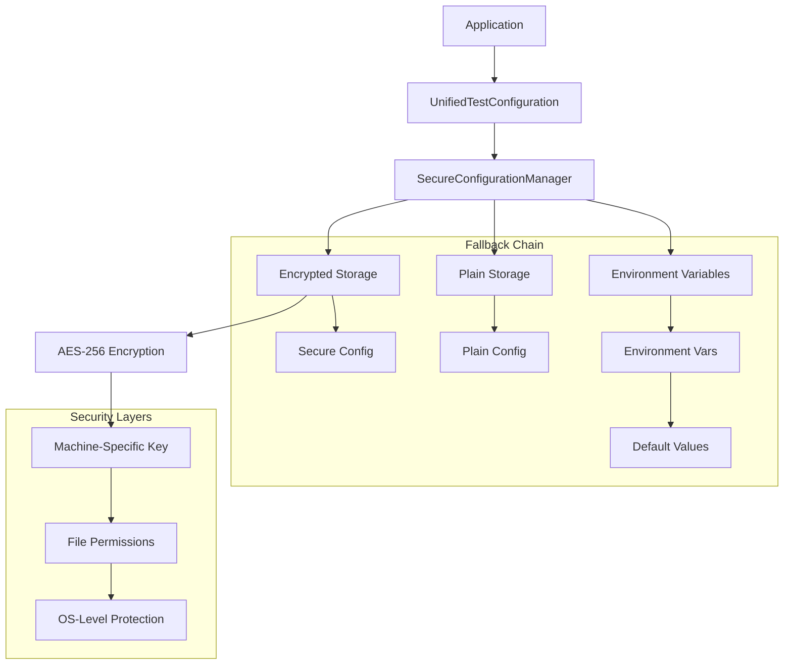

# 🔒 Secure Configuration Reference

Comprehensive reference for MethodCache's secure configuration and credential management system.

## 📋 Table of Contents

- [Security Architecture](#-security-architecture)
- [Configuration Types](#-configuration-types)
- [Encryption Details](#-encryption-details)
- [Platform Security](#-platform-security)
- [API Reference](#-api-reference)
- [Best Practices](#-best-practices)
- [Security Audit](#-security-audit)

## 🏗 Security Architecture

### Overview
The MethodCache secure configuration system provides enterprise-grade security for development credentials and sensitive configuration data across different platforms and development machines.



### Security Principles

1. **Defense in Depth** - Multiple security layers
2. **Principle of Least Privilege** - Minimal access rights
3. **Data Classification** - Secure vs. plain storage
4. **Machine Isolation** - Credentials don't work across machines
5. **Zero Knowledge** - System doesn't log sensitive data

## 📊 Configuration Types

### Secure Configuration (Encrypted)
Used for sensitive data that should never be stored in plain text:

- **API Keys & Tokens** (GitHub, Azure, AWS)
- **Database Passwords**
- **Service Account Credentials**
- **Private Keys & Certificates**
- **OAuth Secrets**

### Plain Configuration (Unencrypted)
Used for non-sensitive operational data:

- **Connection Strings** (without passwords)
- **Timeout Values**
- **Feature Flags**
- **Test Preferences**
- **Environment Names**

### Environment Variables
Runtime configuration that overrides stored values:

- **CI/CD Variables**
- **Container Environment**
- **Shell Configuration**
- **Process Environment**

## 🔐 Encryption Details

### Encryption Algorithm
- **Algorithm:** AES-256-CBC
- **Key Size:** 256 bits (32 bytes)
- **IV:** 128 bits (16 bytes), randomly generated per encryption
- **Key Derivation:** Machine-specific entropy sources

### Key Generation
```csharp
// Simplified key generation process
var entropy = GetMachineEntropy();
var key = SHA256.HashData(entropy);
var base64Key = Convert.ToBase64String(key);
```

### Encryption Process
```csharp
// Encryption workflow
1. Generate random IV (16 bytes)
2. Encrypt data using AES-256-CBC
3. Prepend IV to encrypted data
4. Base64 encode the result
5. Store in *.secure file
```

### Storage Format
```
File: ~/.methodcache/test-config/github_token.secure
Content: Base64(IV + EncryptedData)
```

## 🖥 Platform Security

### Windows Security

#### File Permissions
```powershell
# Configuration directory permissions
icacls "%USERPROFILE%\.methodcache\test-config" /inheritance:d /grant:r "%USERNAME%":(OI)(CI)F /remove "Users" "Everyone"

# File-level permissions
icacls "*.secure" /inheritance:d /grant:r "%USERNAME%":F /remove "Users" "Everyone"
```

#### Key Storage
```
Location: %USERPROFILE%\.methodcache\test-config\.machine-key
Permissions: Full Control for current user only
```

#### Security Features
- **NTFS ACLs** - Windows file system permissions
- **User Profile Isolation** - Per-user configuration
- **DPAPI Integration** - Future enhancement for Windows-specific encryption

### macOS Security

#### File Permissions
```bash
# Configuration directory (700 = rwx------)
chmod 700 ~/.methodcache/test-config/

# Configuration files (600 = rw-------)
chmod 600 ~/.methodcache/test-config/*
```

#### Keychain Integration (Future)
```bash
# Future enhancement: macOS Keychain integration
security add-generic-password -a MethodCache -s "github_token" -w "token_value"
```

#### Extended Attributes
```bash
# Mark sensitive files
xattr -w com.methodcache.sensitive "true" ~/.methodcache/test-config/*.secure
```

### Linux Security

#### File Permissions
```bash
# Configuration directory (700 = rwx------)
chmod 700 ~/.methodcache/test-config/

# Configuration files (600 = rw-------)
chmod 600 ~/.methodcache/test-config/*

# Verify no group/other access
ls -la ~/.methodcache/test-config/
# Should show: -rw------- user user
```

#### SELinux Integration (Future)
```bash
# Future enhancement: SELinux context labeling
semanage fcontext -a -t user_home_t ~/.methodcache
restorecon -R ~/.methodcache
```

#### systemd User Service Protection
```ini
# Future enhancement: systemd service hardening
[Service]
PrivateTmp=true
ProtectSystem=strict
ProtectHome=read-only
NoNewPrivileges=true
```

## 📚 API Reference

### SecureConfigurationManager

#### Constructor
```csharp
// Default configuration directory
var configManager = new SecureConfigurationManager();

// Custom configuration directory
var configManager = new SecureConfigurationManager("/custom/path");
```

#### Secure Operations
```csharp
// Store encrypted value
await configManager.SetSecureAsync("api_key", "secret_value");

// Retrieve encrypted value
string? value = await configManager.GetSecureAsync("api_key");

// Remove encrypted value
await configManager.RemoveAsync("api_key");
```

#### Plain Operations
```csharp
// Store plain value
await configManager.SetAsync("timeout", "00:05:00");

// Retrieve plain value
string? value = await configManager.GetAsync("timeout");
```

#### Fallback Operations
```csharp
// Get with environment variable fallback
string? value = await configManager.GetWithFallbackAsync(
    "redis_connection",
    "METHODCACHE_REDIS_URL",
    "REDIS_URL"
);
```

#### Configuration Management
```csharp
// List all configuration
var items = await configManager.ListConfigurationAsync();

// Initialize defaults
await configManager.InitializeDefaultsAsync();
```

### UnifiedTestConfiguration

#### Initialization
```csharp
var unifiedConfig = new UnifiedTestConfiguration();
var result = await unifiedConfig.InitializeAsync();
```

#### Environment Information
```csharp
var envInfo = unifiedConfig.GetEnvironmentInfo();
Console.WriteLine($"Platform: {envInfo.Platform}");
Console.WriteLine($"Docker Available: {envInfo.Docker.IsRunning}");
```

#### Configuration Access
```csharp
var config = unifiedConfig.GetConfiguration();
var connections = await unifiedConfig.GetOptimizedConnectionStringsAsync();
```

#### Validation
```csharp
var validation = await unifiedConfig.ValidateConfigurationAsync();
if (!validation.IsValid)
{
    Console.WriteLine($"Issues: {validation.SqlServerMessage}");
}
```

### Command Line Interface

#### Setup Commands
```bash
# Interactive setup
dotnet run --project Tests/MethodCache.Tests.Infrastructure setup

# Non-interactive setup
dotnet run --project Tests/MethodCache.Tests.Infrastructure setup --non-interactive

# Validation only
dotnet run --project Tests/MethodCache.Tests.Infrastructure setup --validate-only
```

#### Configuration Commands
```bash
# Set secure value
dotnet run --project Tests/MethodCache.Tests.Infrastructure config set "github_token" "ghp_xxxx" --secure

# Set plain value
dotnet run --project Tests/MethodCache.Tests.Infrastructure config set "redis_connection" "localhost:6379"

# List configuration
dotnet run --project Tests/MethodCache.Tests.Infrastructure config list
```

#### GitHub Integration
```bash
# Setup GitHub credentials
dotnet run --project Tests/MethodCache.Tests.Infrastructure github --token "ghp_xxxx" --repo "owner/repo"
```

## 🛡 Best Practices

### Credential Management

#### DO ✅
- **Use secure storage for all sensitive data**
  ```csharp
  await configManager.SetSecureAsync("api_key", sensitiveValue);
  ```

- **Rotate credentials regularly**
  ```bash
  # Generate new API token
  dotnet run --project Tests/MethodCache.Tests.Infrastructure config set github_token "new_token" --secure
  ```

- **Use environment variables in CI/CD**
  ```yaml
  env:
    METHODCACHE_REDIS_URL: ${{ secrets.REDIS_URL }}
  ```

- **Validate configuration before use**
  ```csharp
  var validation = await unifiedConfig.ValidateConfigurationAsync();
  if (!validation.IsValid) throw new InvalidOperationException();
  ```

#### DON'T ❌
- **Never store passwords in plain configuration**
  ```csharp
  // ❌ Wrong - exposes password
  await configManager.SetAsync("db_password", "secret123");

  // ✅ Correct - encrypted storage
  await configManager.SetSecureAsync("db_password", "secret123");
  ```

- **Don't commit configuration files**
  ```gitignore
  # Add to .gitignore
  .methodcache/
  test-config/
  *.secure
  ```

- **Don't share encryption keys**
  ```bash
  # ❌ Never copy .machine-key between machines
  # Each machine should generate its own key
  ```

### File System Security

#### Verify Permissions
```bash
# Check configuration directory permissions
ls -la ~/.methodcache/test-config/

# Should show:
# drwx------ (700) for directory
# -rw------- (600) for files
```

#### Audit File Access
```bash
# Linux: Monitor file access
auditctl -w ~/.methodcache/test-config/ -p ra -k methodcache_config

# macOS: Use fs_usage to monitor access
sudo fs_usage -w | grep methodcache
```

### Development Workflow

#### Team Setup
```bash
# Each developer runs individual setup
./scripts/setup-dev-env.sh

# Share non-sensitive configuration
git add .vscode/settings.json
git add docker-compose.dev.yml

# Don't share sensitive configuration
echo ".methodcache/" >> .gitignore
```

#### Environment Isolation
```bash
# Development environment
dotnet run --project Tests/MethodCache.Tests.Infrastructure config set env "development"

# CI environment
dotnet run --project Tests/MethodCache.Tests.Infrastructure config set env "ci" --config-path /ci/config

# Production-like testing
dotnet run --project Tests/MethodCache.Tests.Infrastructure config set env "staging" --config-path /staging/config
```

### CI/CD Security

#### Secrets Management
```yaml
# GitHub Actions
steps:
  - name: Setup Environment
    env:
      METHODCACHE_REDIS_URL: ${{ secrets.REDIS_URL }}
      METHODCACHE_SQLSERVER_URL: ${{ secrets.SQL_SERVER_URL }}
    run: ./scripts/setup-dev-env.sh --non-interactive
```

#### Container Security
```yaml
# docker-compose.override.yml for CI
version: '3.8'
services:
  sqlserver:
    environment:
      - SA_PASSWORD=$SQL_SERVER_PASSWORD
  redis:
    command: redis-server --requirepass $REDIS_PASSWORD
```

## 🔍 Security Audit

### Regular Audits

#### Configuration Audit
```bash
# List all configuration with metadata
dotnet run --project Tests/MethodCache.Tests.Infrastructure config list

# Check for old or unused configuration
find ~/.methodcache/test-config/ -mtime +30 -name "*.secure"
```

#### Permission Audit
```bash
# Verify file permissions
stat -c "%a %n" ~/.methodcache/test-config/*

# Should show:
# 600 for files
# 700 for directories
```

#### Key Rotation Audit
```bash
# Check machine key age
stat ~/.methodcache/test-config/.machine-key

# Rotate if older than 90 days
if [[ $(find ~/.methodcache/test-config/.machine-key -mtime +90) ]]; then
    echo "Key rotation recommended"
fi
```

### Security Checklist

#### Initial Setup ✅
- [ ] Configuration directory has correct permissions (700)
- [ ] Configuration files have correct permissions (600)
- [ ] Machine key is generated and secured
- [ ] No sensitive data in environment variables
- [ ] .gitignore excludes configuration directory

#### Regular Maintenance ✅
- [ ] Audit configuration monthly
- [ ] Rotate API tokens quarterly
- [ ] Review file permissions
- [ ] Check for unused configuration
- [ ] Update encryption keys annually

#### Incident Response ✅
- [ ] Procedure for credential compromise
- [ ] Method to revoke and rotate all credentials
- [ ] Audit log analysis capability
- [ ] Team notification process

### Compliance Considerations

#### Data Classification
- **Public:** Non-sensitive configuration (timeouts, feature flags)
- **Internal:** Connection strings without credentials
- **Confidential:** API keys, passwords, tokens
- **Restricted:** Private keys, certificates

#### Regulatory Compliance
- **GDPR:** No personal data in configuration
- **SOX:** Audit trails for configuration changes
- **HIPAA:** Encryption at rest and in transit
- **PCI DSS:** Secure key management practices

### Threat Model

#### Threats Mitigated ✅
- **File system access** - File permissions and encryption
- **Memory dumps** - Secure string handling
- **Network interception** - Local-only configuration
- **Cross-machine access** - Machine-specific keys
- **Accidental exposure** - Automatic encryption

#### Residual Risks ⚠️
- **Physical access** - Disk encryption recommended
- **Privilege escalation** - OS-level security required
- **Memory forensics** - Process memory protection
- **Side-channel attacks** - Timing analysis resistance

### Security Monitoring

#### Log Monitoring
```bash
# Monitor configuration access (Linux)
tail -f /var/log/audit/audit.log | grep methodcache

# Monitor file changes
inotifywait -m ~/.methodcache/test-config/
```

#### Alerting Setup
```bash
# Set up file modification alerts
echo "~/.methodcache/test-config/" | entr -p echo "Configuration modified"

# Monitor for permission changes
find ~/.methodcache/test-config/ -not -perm 600 -exec echo "Permission issue: {}" \;
```

---

## 📚 References

### Standards and Specifications
- **AES-256:** [FIPS 197](https://nvlpubs.nist.gov/nistpubs/FIPS/NIST.FIPS.197.pdf)
- **File Permissions:** [POSIX.1-2017](https://pubs.opengroup.org/onlinepubs/9699919799/)
- **Key Management:** [NIST SP 800-57](https://nvlpubs.nist.gov/nistpubs/SpecialPublications/NIST.SP.800-57pt1r5.pdf)

### Platform Documentation
- **Windows ACLs:** [Microsoft Docs](https://docs.microsoft.com/en-us/windows/win32/secauthz/access-control-lists)
- **macOS Security:** [Apple Security Guide](https://support.apple.com/guide/security/)
- **Linux Security:** [Red Hat Security Guide](https://access.redhat.com/documentation/en-us/red_hat_enterprise_linux/8/html/security_hardening/)

### Cryptographic Libraries
- **.NET Cryptography:** [System.Security.Cryptography](https://docs.microsoft.com/en-us/dotnet/api/system.security.cryptography)
- **OpenSSL:** [OpenSSL Documentation](https://www.openssl.org/docs/)

This secure configuration system provides enterprise-grade security for development environments while maintaining ease of use and cross-platform compatibility.